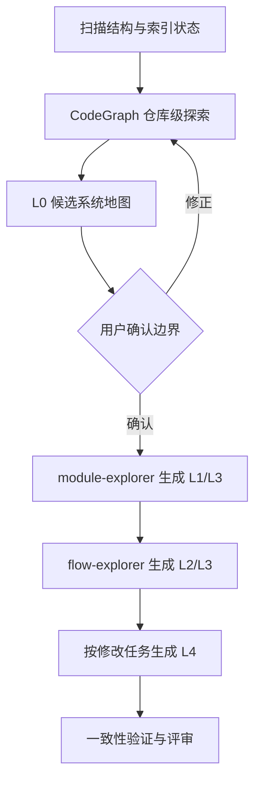

# Project Context CodeGraph 知识地图技术设计

## 背景

现有 `project-context` 已具备 project/module/flow 三层文档和 explorer 上下文隔离，但 CodeGraph 部分基于未经验证的 CLI 假设：把 `query`、`impact`、`stats` 当作主要语义接口，并把“影响面”近似成业务调用链。当前上游默认 MCP 仅暴露 `codegraph_explore`；该工具一次返回相关符号源码、调用路径和影响摘要，更适合大仓库的精准上下文。

本次将现有三层文档升级为 L0-L4 可导航知识地图，并在真实的 `nxapp` 上用“报警限推荐”完成从索引、查询、文档生成到评审的闭环。

## 设计目标与范围排除

**设计目标：**

- 默认 MCP 契约只依赖 `codegraph_explore`，不虚构未启用工具。
- 70 万行项目初始扫描不全量读取源码，不递归 grep 调用关系。
- L0 10-30 节点，L1 ≤25 核心构件，L2 8-20 关键节点，L4 默认两层。
- 所有重要关系具有源码位置和 `Verified/Graph-Heuristic/Inferred/Unknown` 证据等级。
- project/module/flow 图之间保持一致，真实项目产物通过自动化校验和人工可读性评审。
- Claude Code 为唯一源码，平台包通过生成适配而不是手工复制。

**范围排除：**

- 不修改 `nxapp` 业务实现。
- 不提交 `.codegraph` 数据库。
- 不保证 CodeGraph 能解析所有动态关系；缺口必须显式记录。
- 不在本次重新设计整个 EdanSpec feature 工作流。

## 技术决策

### 决策一：使用 `codegraph_explore` 作为唯一必需 MCP 能力

**决策**：主 Agent 优先调用 `mcp__codegraph__codegraph_explore`；若 explorer 子 Agent 未获得 MCP 工具，则调用等价 CLI `codegraph explore "<query>"`。`query/callers/callees/impact` 仅作为用户显式启用后的可选能力，不写入核心流程依赖。

**理由：**

- 与上游默认 MCP 面一致。
- 一个查询同时返回源码、关系图和影响摘要，减少错误选工具和重复文件读取。
- `projectPath` 可显式指向目标项目，适合从 EdanSpec 工作目录分析其他工程。

**替代方案对比：**

| 方案 | 优势 | 劣势 | 适用场景 |
|------|------|------|---------|
| 依赖多个隐藏 MCP 工具 | 查询粒度细 | 默认不暴露，配置漂移，易虚构接口 | 用户显式设置 `CODEGRAPH_MCP_TOOLS` |
| 单一 `codegraph_explore`（首选） | 默认可用、上下文完整、跨平台一致 | 需要在 prompt 中约束范围和节点数 | project-context 默认流程 |
| 仅使用 CLI `query/impact` | 易脚本化 | 子命令语义容易被误用，主 Agent MCP 优势丢失 | MCP 未连接的降级环境 |

### 决策二：将三层文档映射为 L0-L4

**决策**：

- L0：`project.md` 系统地图。
- L1：`module.md` 模块/核心构件地图。
- L2：`flow.md` 单业务场景流程。
- L3：嵌入 module/flow 的证据表和按需代码证据图。
- L4：`context/impacts/{topic}.md` 按需影响分析。

**理由：**

- 复用现有目录与下游 Skill 读取契约。
- 人类从系统到代码逐级下钻，不需要面对全量符号图。
- 影响分析具有任务时效性，不应固化到每个模块文档。

**替代方案对比：**

| 方案 | 优势 | 劣势 | 适用场景 |
|------|------|------|---------|
| 一张全量图 | 信息齐全 | 70 万行项目不可读 | 小型演示 |
| 现有 project/module/flow | 结构简单 | 缺证据层和影响层 | 无 CodeGraph 的小项目 |
| L0-L4 分层（首选） | 可导航、可验证、按需展开 | 需要模板和一致性门禁 | 中大型工程 |

### 决策三：主 Agent 持有边界，Explorer 持有专题证据

**决策**：主 Agent完成索引自检、仓库级 CodeGraph 查询、L0 候选和用户确认；explorer 只处理一个模块或一个业务流，并消费主 Agent 传入的边界和证据线索。explorer 可定向补充 CodeGraph 查询，但不得回退为全库 grep。

**理由：**

- 模块边界需要跨模块视野，不能由单模块 explorer 自行决定。
- 专题文档需要较深局部上下文，适合隔离执行。
- 与上游“直接使用图而不是重复文件探索”和现有“子 Agent 不回传全文”原则兼容。

**替代方案对比：**

| 方案 | 优势 | 劣势 | 适用场景 |
|------|------|------|---------|
| 主 Agent 全部生成 | 一致性集中 | 上下文膨胀 | 小仓库 |
| 子 Agent 自由全库探索 | 局部并行 | 重复读取、边界不一致 | 不采用 |
| 主 Agent 边界 + explorer 专题（首选） | 一致且节省上下文 | 需要结构化输入输出契约 | 大仓库 |

### 决策四：证据等级写入文档而不是另建图数据库

**决策**：每个模板包含证据表和已知盲区；Mermaid 中 Verified 使用实线，Graph-Heuristic/Inferred 使用虚线并标明状态，Unknown 使用“待确认”节点。源码路径留在表格，不塞入图节点。

**理由：**

- 文档对工程师可读且可在代码评审中 diff。
- 不引入与 `.codegraph` 重复的第二套数据库。
- 下游 Skill 可直接搜索符号、路径和证据等级。

### 决策五：扫描脚本提供快速模式

**决策**：`scan-project.py` 保留确定性结构采集，但修正 `.codegraph/codegraph.db` 检测，并提供不逐文件计行的快速模式。大项目或索引存在时默认建议快速模式；详细行数只在明确需要时执行。

**理由：**

- CodeGraph 已承担语义和符号统计，扫描脚本无需重复高成本工作。
- 目录树、构建文件和语言分布仍需要确定性事实来源。

## 数据与文档结构

```text
EdanSpec/context/
├── project.md
├── modules/
│   └── {module}/
│       ├── module.md
│       └── flows/{flow}.md
└── impacts/{topic}.md
```

每个图谱文档的统一证据结构：

| 节点/关系 | 工程职责 | 代码符号 | 源码位置 | 证据等级 | 说明 |
|-----------|----------|----------|----------|----------|------|

## 时序与交互



## 风险与应对

- **MCP 未在当前会话加载** → 使用 `codegraph explore` CLI 等价回退，并在结果中记录降级。
- **CodeGraph 对 Qt/QML、宏、signal/slot 关系解析不完整** → 输出 Unknown 和确认性源码读取，不补造关系。
- **`codegraph_explore` 返回过多源码** → 查询中明确业务场景、模块路径和节点上限，一次只解决一个问题。
- **现有工作区有未提交改动** → 仅修改和暂存本 feature 相关文件，保留其他用户改动。
- **目标目录不是 Git 仓库** → 生成物单独报告，不执行提交，不改业务代码。
- **三平台副本漂移** → 保持 Claude Code 唯一源码，在离线打包验证中检查派生产物，不手工长期同步。

## 测试策略

- **扫描脚本单元测试**：索引路径、快速模式、忽略目录、语言统计。
- **Skill 契约测试**：禁止旧的默认 `query/impact/stats` 流程；必须包含 `codegraph_explore`、L0-L4、证据等级、节点上限。
- **模板测试**：project/module/flow/impact 均含证据与盲区结构。
- **站点测试**：生成文档可被现有 context browser 渲染和检索。
- **真实集成测试**：`codegraph init/status/explore` 在 `nxapp` 成功，报警限推荐文档可追溯到实际符号和路径。
- **评审**：三维验证 + 四维代码审查，CRITICAL/IMPORTANT 全部闭环。
