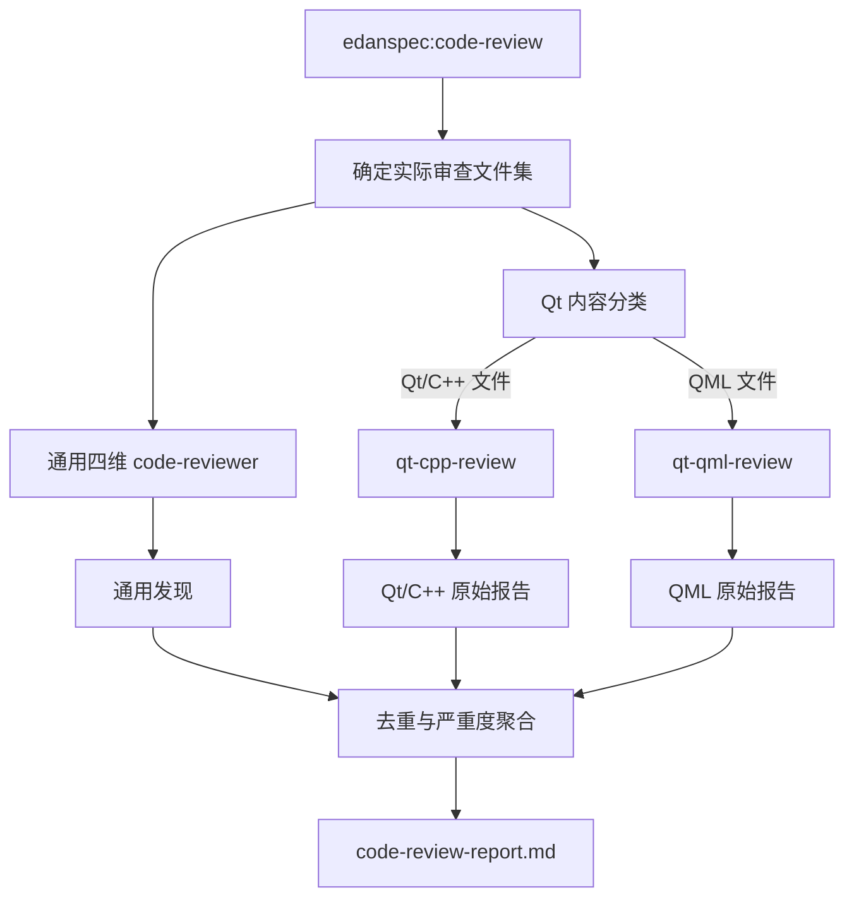
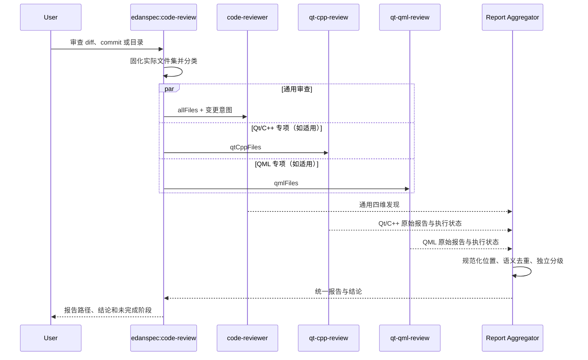

# Qt 专项代码审查 Skill 集成技术设计

## 背景

`edanspec:code-review` 当前负责确定审查范围、启动通用四维 reviewer、分级问题并持久化 `code-review-report.md`。其检查项主要面向通用语言与 Java/Kotlin 等项目，无法系统覆盖 Qt 6 的 model/view 契约、QObject 所有权、线程亲和性、信号槽、QML binding、delegate 生命周期和渲染性能。

现有 `qt-cpp-review` 与 `qt-qml-review` 已提供确定性 lint、六维深度分析和结构化报告。本变更不重新实现 Qt 规则，而是把两个 skill 作为 EdanSpec 内置专项能力，由总审查流程按实际内容路由，并通过现有离线构建链分发到 Claude Code、OpenCode 和 Kilo Code。

## 设计目标与范围排除

**设计目标：**

- Qt/C++、QML 和混合审查范围的专项路由准确率在契约测试样例中达到 100%。
- Java 与无 Qt 证据的普通 C++ 样例不得误触发 Qt 专项 skill。
- 三个平台离线包均完整包含两个 Qt skill 的入口、引用文件、lint 脚本和许可证。
- Qt 专项原始发现可追溯，统一报告按位置和语义去重，且结论确定性地产生 `APPROVE`、`REQUEST_CHANGES` 或 `INCOMPLETE`。
- 任一必要专项阶段未完成时不得产生完整 `APPROVE`。

**范围排除：**

- 不改变 `project-context`、CodeGraph 或项目知识地图流程。
- 不在通用 reviewer 中重新实现或复制 Qt 检查规则。
- 不支持 Qt 5 专属审查契约。
- 不自动启用 Qt framework/module 模式。
- 不修改被审查代码；所有审查过程保持只读。

## 架构概览

沿用现有 skill 编排架构，增加“范围分类—专项路由—报告聚合”三个职责。Claude Code 下的 Qt skill 目录是唯一权威源码；OpenCode 包由构建器覆盖派生，Kilo 包继续从已适配的 OpenCode stage 派生。



## 技术决策

### 决策一：由 `edanspec:code-review` 统一编排 Qt 专项审查

**决策**：保留 `edanspec:code-review` 作为唯一用户入口，在确定实际审查文件集后执行通用 reviewer，并根据分类结果调用一个或两个 Qt skill。

**理由**：

- 当前 skill 已承担范围、执行和报告持久化职责，Qt 路由属于相同编排层。
- 用户无需预先知道目标变更是否同时包含 C++ 与 QML。
- `project-context` 负责项目理解与调用链证据，不应承担合并前质量审查。

**替代方案对比**：

| 方案 | 优势 | 劣势 | 适用场景 |
|------|------|------|---------|
| 在 `project-context` 中触发 | 可利用知识地图上下文 | 混淆走读与质量审查，非变更范围也可能被扫描 | 项目建模 |
| `edanspec:code-review` 统一编排（首选） | 单入口、范围一致、报告可统一 | 需要新增路由和聚合契约 | 合并前审查 |
| 用户手工调用 Qt skill | 实现最少 | 易漏调，无法保证完整结论 | 临时专项检查 |

### 决策二：以文件类型加内容证据识别 Qt 范围

**决策**：`.qml` 文件直接归入 QML 范围；C++ 扩展名文件只有出现明确 Qt 证据，或其已确认构建上下文声明 Qt 目标时，才归入 Qt/C++ 范围。

Qt 证据至少包括以下一类：

- `#include <Qt...>`、`#include <Q...>` 或 Qt 模块私有头文件；
- `QObject`、`QAbstractItemModel` 等明确 Qt 类型；
- `Q_OBJECT`、`Q_GADGET`、`Q_PROPERTY`、`Q_INVOKABLE` 等 Qt 宏；
- `signals`、`slots`、`emit` 与已确认 QObject 上下文；
- `find_package(Qt6 ...)`、`qt_add_executable`、`qt_add_qml_module` 等与文件所属 target 可关联的构建声明。

分类结果形成一次性“审查范围清单”，包含 `allFiles`、`qtCppFiles`、`qmlFiles` 和触发证据摘要，供后续阶段复用，避免各 reviewer 自行扩大范围。

**理由**：仅凭 C++ 扩展名会误触发普通 C++ 项目；仅凭单个宏或目录名又可能漏掉通过构建 target 关联的 Qt 文件。文件内容与已确认构建上下文结合能兼顾精确度和召回率。

**替代方案对比**：

| 方案 | 优势 | 劣势 | 适用场景 |
|------|------|------|---------|
| 所有 C++ 都触发 | 不漏 Qt 文件 | 普通 C++ 大量误触发 | Qt-only 仓库 |
| 仅按扩展名和目录名 | 快速 | 目录约定不可靠 | 结构固定的小项目 |
| 文件内容 + 构建证据（首选） | 误触发低，可解释 | 需记录触发证据 | 混合语言仓库 |

### 决策三：完整保留 Qt skill 阶段，不内嵌规则

**决策**：总编排器通过 skill 名称调用 `qt-cpp-review` 和 `qt-qml-review`，各 skill 自行执行其确定性 lint、可选系统工具、六维深度分析和原始报告整理。总编排器只传入受限文件列表及审查语义，不复制检查清单。

**理由**：

- 保留 Qt skill 的独立升级能力和许可证边界。
- 确定性 lint 是其权威规则来源，复制规则会造成漂移。
- 专项报告需要保留原始编号、类别、置信度和 trace，便于复核。

**替代方案对比**：

| 方案 | 优势 | 劣势 | 适用场景 |
|------|------|------|---------|
| 将规则复制到通用 reviewer | 单次调用 | 规则漂移、失去 lint 与专项格式 | 无独立 skill 环境 |
| 只运行 lint | 快速确定 | 漏掉所有语义与调用链问题 | 快速预检 |
| 完整调用专项 skill（首选） | 覆盖完整、可独立升级 | 执行成本更高 | 合并前正式审查 |

### 决策四：Claude Code 是 Qt skill 唯一权威源码

**决策**：完整源码放在：

- `claudecode/.claude/skills/qt-cpp-review/`
- `claudecode/.claude/skills/qt-qml-review/`

`build_offline_bundles.py` 在 OpenCode stage 中从这两个目录执行适配复制；Kilo stage 沿用现有机制从 OpenCode stage 复制并替换平台路径。构建器扩展为可指定目标 skill 名的通用 overlay，避免继续写死 `project-context`。

**理由**：

- 与当前 `project-context` 的“Claude 唯一源码—构建派生”策略一致。
- Qt skill 包含多份检查清单、脚本和许可证，维护三份仓库源码容易漂移。
- 构建期验证可确保每次发布的三平台内容一致。

**替代方案对比**：

| 方案 | 优势 | 劣势 | 适用场景 |
|------|------|------|---------|
| 三平台各维护一份 | 平台目录直观 | 更新易漂移，许可证和脚本容易漏同步 | 平台实现差异很大 |
| Claude 唯一源码、构建派生（首选） | 单一真相、可验证 | 构建器需支持通用 skill overlay | 内容主体一致的 skill |
| 运行时引用用户目录 | 不增加仓库体积 | 离线不可用、环境不可复现 | 个人本机试用 |

### 决策五：原始报告保真，统一报告独立分级

**决策**：被触发的专项 skill 分别写入 `qt-cpp-review-report.md` 和 `qt-qml-review-report.md`；聚合器按规范化位置与问题语义去重后写入 `code-review-report.md`。Qt `Confidence` 只决定可信度，不直接决定 EdanSpec 严重度。

统一问题项增加以下可选字段：

```text
来源：通用审查 / qt-cpp-review / qt-qml-review
Qt 原始编号：L-NNN / D-NNN / I-NNN
Qt 规则：规则 ID
置信度：NN/100
追踪：确认该问题的符号或调用路径
```

结论优先级为：

1. 存在已确认 `CRITICAL` → `REQUEST_CHANGES`；若同时有阶段缺失，另在完整性字段标记“不完整”。
2. 无 `CRITICAL`，但任一必要专项阶段未完成 → `INCOMPLETE`。
3. 所有必要阶段完成且无 `CRITICAL` → `APPROVE`。

Investigation target 进入“待人工确认”章节，不单独触发 `CRITICAL`；人工确认后再按影响重新分级。

**理由**：可信度与业务影响是两个正交维度。保留原始报告可以审计，统一报告则继续兼容 `task-implement` 的门禁入口。

**替代方案对比**：

| 方案 | 优势 | 劣势 | 适用场景 |
|------|------|------|---------|
| 只链接原始报告 | 无转换成本 | `task-implement` 无法统一判定 | 人工审查 |
| 置信度直接映射严重度 | 算法简单 | 高置信度小问题会被错误升为 CRITICAL | 不适用 |
| 原始报告 + 独立聚合（首选） | 可追溯且兼容现有门禁 | 需定义去重和映射规则 | 自动化审查流水线 |

## 组件职责

| 组件 | 变更后职责 | 不负责 |
|------|------------|--------|
| `edanspec:code-review` | 确定范围、分类、调用通用/专项审查、聚合、持久化 | 实现 Qt 具体规则、修改代码 |
| `code-reviewer` | 执行通用四维审查，提供 EdanSpec 严重度建议 | 替代 Qt 专项检查 |
| `qt-cpp-review` | Qt 6 C++ lint 与六维深度分析 | 普通 C++ 通用审查、自动修复 |
| `qt-qml-review` | QML lint、可选 qmllint 与六维深度分析 | 非 QML 文件、自动修复 |
| 离线包构建器 | 从权威源码派生、适配、完整性验证和归档 | 在线安装外部依赖 |

## 审查状态模型

每次审查在报告中记录以下逻辑状态；不引入数据库或额外运行时状态文件：

| 字段 | 值 | 含义 |
|------|----|------|
| `genericReview` | `complete` / `failed` | 通用四维审查状态 |
| `qtCppReview` | `not-applicable` / `complete` / `partial` / `failed` | Qt/C++ 专项状态 |
| `qmlReview` | `not-applicable` / `complete` / `partial` / `failed` | QML 专项状态 |
| `conclusion` | `APPROVE` / `REQUEST_CHANGES` / `INCOMPLETE` | 最终门禁结论 |

Python 不可用导致 lint 缺失时，专项状态为 `partial`；`qmllint` 本身是可选阶段，不可用时记录备注但不会单独把 QML 状态降为 `partial`。

## 时序与交互



## 报告接口设计

### 输入契约

总编排器传递给专项 skill 的输入 SHALL 包含：

- 审查语义：diff、commit 或 codebase scope；
- 匹配文件的明确列表；
- 每组文件的 Qt 触发证据摘要；
- 不得扩大的范围约束；
- feature 目录路径（存在时），用于持久化专项报告。

### 输出契约

专项输出保留原 skill 的报告格式。统一报告模板增加：

- `审查完整性` 字段；
- 通用、Qt/C++、QML 三个阶段的状态表；
- 每个聚合问题的来源与 Qt 可追溯字段；
- “待人工确认”章节；
- `INCOMPLETE` 结论说明。

不在 feature 上下文中时，保持现有行为：报告输出到控制台，不强制写入仓库文件；若运行环境支持临时报告路径，可展示其位置但不得修改被审查项目源码。

## 打包与派生设计

1. `stage_claudecode` 继续复制完整 `.claude` 树，因此自动包含新增 Qt skill。
2. `stage_opencode` 完成现有 OpenCode 树复制后，调用通用 overlay 函数：
   - 从 Claude 源覆盖派生 `qt-cpp-review`；
   - 从 Claude 源覆盖派生 `qt-qml-review`；
   - 将更新后的总审查编排规则适配为 `edanspec-code-review`，避免包内调用契约漂移。
3. `stage_kilocode` 从 OpenCode stage 派生，因此继承上述三个已适配 skill。
4. `validate_stage` 对三个 skill 执行入口存在性、frontmatter 名称、引用文件、lint 脚本和许可证检查，并继续执行平台路径泄漏检查。
5. ZIP manifest 和 SHA-256 机制保持不变。

## 异常处理

- **Qt skill 或引用文件缺失**：构建期直接失败，错误中包含目标平台和缺失相对路径。
- **Python 不可用**：专项报告记录 lint 阶段未运行，继续深度分析；统一完整性标为不完整。
- **`qmllint` 不可用**：按原 QML skill 契约记录 warning，其他阶段完成时仍视为完整。
- **单个专项执行失败**：保留已完成报告和发现；失败专项状态为 `failed`，最终不得 `APPROVE`。
- **报告无法解析或缺少必要字段**：原始报告仍保留，聚合阶段记录失败并产生 `INCOMPLETE`。
- **重复发现无法可靠合并**：宁可保留两个带来源的问题，也不得错误丢弃；只对文件、位置和语义均一致的发现合并。
- **Qt framework 模式信号满足**：暂停该模式的专项扩展并请求用户确认；不影响通用模式先行完成。

## 迁移与回滚

- 新增 Qt skill 不改变非 Qt 项目的调用结果；Java 和普通 C++ 继续走原通用路径。
- 原 `code-review-report.md` 的核心章节和严重度保持兼容，新增字段和章节为向后兼容扩展。
- `task-implement` 需要把 `INCOMPLETE` 视为未通过；原 `APPROVE` 与 `REQUEST_CHANGES` 语义不变。
- 回滚时可移除 Qt skill overlay 与路由章节，恢复旧报告模板；不涉及数据迁移和外部 API。

## 测试策略

### 契约测试

- 解析 `edanspec:code-review`，验证通用审查始终执行以及 Qt 路由、文件隔离、失败语义和报告路径均有明确指令。
- 验证 `qt-cpp-review`、`qt-qml-review` 的 frontmatter 名称和所有相对引用可解析。
- 验证两个 skill 的许可证存在，且 README、检查清单和 lint 脚本未被打包排除规则删除。

### 路由测试

使用最小 fixture 覆盖：

| Fixture | 通用审查 | Qt/C++ | QML |
|---------|----------|--------|-----|
| Java | 是 | 否 | 否 |
| 普通 C++ | 是 | 否 | 否 |
| 含 Qt 头文件的 C++ | 是 | 是 | 否 |
| 纯 QML | 是 | 否 | 是 |
| Qt/C++ + QML | 是 | 是 | 是 |

### 报告测试

- 相同文件、行号和语义的跨 reviewer 发现只生成一个统一问题。
- 置信度与严重度分别保留，不存在数值直映射。
- investigation target 进入独立章节。
- 结论矩阵覆盖：完整无 CRITICAL、存在 CRITICAL、无 CRITICAL 但阶段不完整、CRITICAL 与阶段不完整同时存在。

### 离线包集成测试

- 构建并解压三平台 ZIP，逐一验证两个 Qt skill 及所有必要资源。
- 验证 OpenCode/Kilo frontmatter 名称等于目录名，且无 `.claude/` 路径泄漏。
- 对每个平台解压产物中的两个 Python lint 脚本运行最小 Qt/C++ 和 QML fixture，断言进程可启动并产生预期格式输出。
- 删除 fixture stage 中任一许可证或 lint 脚本，断言 `validate_stage` 确定性失败。

## 风险与应对

- **Qt skill 上游更新导致本地副本滞后** → 在 README 或版本元数据中保留来源、版本与许可证；后续更新只替换 Claude 权威源码并运行三平台测试。
- **文本驱动的内容分类出现漏判** → 固定证据清单并用混合 fixture 覆盖；无法确认时在审查范围摘要中明确列为人工确认项。
- **完整专项审查执行成本较高** → 严格限制为实际 diff/commit/目录文件集，超过现有规模阈值时沿用分段审查建议。
- **通用与专项问题重复但表述不同** → 去重要求位置与语义同时一致；不确定时保留，不以减少数量为目标。
- **`INCOMPLETE` 破坏旧消费方的二值判断** → 同步更新 `task-implement` 契约与测试，使未知结论按未通过处理。
- **许可证遗漏或被派生规则过滤** → 构建时把许可证作为强制文件验证，缺失即失败。
