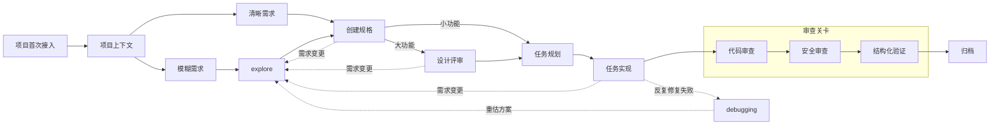

# edan-spec

一套结构化的 AI 辅助软件开发工作流规范，包含 Agent 行为准则、编码规范、技能（Skills）库和文档模板。

## 核心理念

- **规划先行** — 复杂任务需先产出设计方案并经确认，避免方向性偏差导致返工
- **证据驱动** — 以实际构建工具和测试验证命令的执行结果作为完成标准，禁止依赖主观判断或自行推测代码正确性
- **增量开发** — 每个增量独立完成一条验收标准，原子提交
- **变更即目录** — 以 feature 目录聚合提案、规格、设计、任务等全部交付物，通过文件系统状态恢复工作上下文，不依赖会话记忆

## 背景与目标

### Vibe Coding 的缺点

Vibe Coding 是一种无结构的 AI 辅助开发模式：开发者描述需求后，AI 直接生成代码，中间不经过需求澄清、方案设计或结构化验证。适用于原型验证或一次性功能代码编写，但在工程化场景下面临多维度缺陷：

| 困境 | 具体表现 | 后果 |
|------|---------|------|
| **需求理解偏差** | AI 基于概率自行补全模糊需求，缺少确认环节 | 交付物与用户真实需求产生偏离 |
| **批量生成难以排查** | 一次性生成大量代码，决策过程不透明 | 出现问题时无法分步定位，排查成本高，往往只能全盘推翻 |
| **上下文断裂** | AI 会话相互独立，无法感知历史决策和实现细节 | 接口不匹配、命名风格不一致、重复实现同一逻辑 |
| **质量保障缺失** | 无代码审查、安全审查和结构化验证环节 | 安全漏洞、性能瓶颈、边界条件遗漏直接进入主分支 |
| **架构设计缺失** | 跳过方案对比和架构评审直接编码 | 每次实现都是局部最优，技术债务快速累积 |
| **变更不可追溯** | 大批量代码一次性提交，缺少"为什么这样改"的记录 | 线上缺陷无法回溯变更动机，修复缺乏依据 |

### EdanSpec 的目标与方案

EdanSpec 是一套面向工程化场景的 AI 辅助软件开发工作流规范。其核心设计思想是：**将传统软件工程中经过验证的最佳实践（需求分析、方案设计、代码审查、测试验证）适配到 AI 辅助开发场景中，形成一套结构化的、可重复的、可追溯的工作流。**

EdanSpec 的目标可以概括为三个关键词：**可控、可验证、可追溯。**

| 目标 | 对应问题 | 实现方式 |
|------|---------|----------|
| **可控** | 需求偏差、架构失控、技术债务 | `explore` 需求澄清 → `create-spec` 方案确认 → `design-review` 架构评审，先规划后实现 |
| **可验证** | 质量无保障、缺陷直达生产 | 增量开发，每个任务独立完成验收；`code-review` + `security-review` + `verify` 三重关卡 |
| **可追溯** | 变更不可查、上下文断裂 | 变更工单机制（一个变更 = 一个目录），完整保留 proposal、spec、design、tasks 等交付物；从文件系统事实恢复上下文，不依赖会话记忆 |

简而言之：**传统 AI 辅助开发是"描述即实现，完成后检查"；EdanSpec 是"澄清后规划，实现即验证"。**

## 规范目录结构

```
├── AGENTS.md                    # 唯一规范源（核心铁律 + 上下文管理 + 变更工单）
│                                #   Claude Code 的 CLAUDE.md 由 setup.sh / setup.bat 派生
├── README.md                    # 项目概览
├── opencode.json                # OpenCode 配置（指令加载 + 权限）
├── docs/                        # 补充文档
│   ├── anti-patterns.md         # 常见误区与反驳
│   └── git-conventions.md       # Git 操作规范
├── rules/                       # 编码规范
│   ├── common/                  # 通用编码风格（所有语言适用）
│   ├── java/                    # Java 编码风格
│   └── kotlin/                  # Kotlin 编码风格
└── skills/                      # 技能集合（一份，双平台通用）
    ├── project-context/         # 项目上下文初始化（扫描项目 → 生成知识地图）
    ├── edanspec-explore/        # 探索模式（需求澄清 + 方案比较）
    ├── edanspec-create-spec/    # 创建规格（feature 目录 + proposal / spec / design）
    ├── edanspec-design-review/  # 设计评审（八章方案 + 八章详细设计）
    ├── edanspec-task-plan/      # 任务规划（拆分为可执行任务清单）
    ├── edanspec-task-implement/ # 任务实现（TDD 循环 + 原子提交）
    ├── edanspec-debugging/      # 调试排障（五步流程）
    ├── edanspec-code-review/    # 代码审查（四维度评估，含 reviewer-agent.md）
    ├── edanspec-security-review/# 安全审查（五维度检查，含 security-reviewer-agent.md）
    ├── edanspec-verify/         # 结构化验证（三维度验收，含 verifier-agent.md）
    └── edanspec-archive/        # 归档（delta spec 合并 + 文件移动）
```


## 工作流



**项目入口**：新项目首次接入时先执行 `project-context`，生成知识地图后再进入后续 feature 工作流。

**两个需求入口**：模糊需求走 `explore` 澄清后再进 `create-spec`；清晰需求跳过 `explore` 直接进入 `create-spec`。

**四条回流线**：
1. 需求变更/方向调整 → 回到 `explore` 重新评估
2. `design-review` 完成后 → 回归 `task-plan` 拆分任务
3. `task-implement` 完成后 → 三个审查关卡全部通过才继续归档
4. 同一问题反复修复失败 → 第 1-2 次正常修复；第 3 次停下来重新定位根因（调 `debugging`）；第 4 次回到 `explore` 重新审视方案；第 5 次停止并报告

## 使用说明

> **前置条件**：本项目以 [Claude Code CLI](https://claude.ai/code) 为默认 Agent 工具。以下示例均以 Claude Code 为例，其他支持 MCP/Skill/SubAgent 协议的 Agent 工具可类比操作。

### 快速开始

#### 1. 进入项目目录

```bash
cd /path/to/your/project
```

#### 2. 执行初始化脚本

**macOS / Linux**（`setup.sh`）：

```bash
# 单一规范源维护一份资产，setup.sh 按平台展开部署到目标项目
# claudecode  — 部署到 {target}/.claude/（AGENTS.md 派生为 CLAUDE.md + docs + rules + skills）
# opencode    — 部署到 {target}/.opencode/（AGENTS.md + docs + rules + skills）+ opencode.json
/path/to/edan-spec/setup.sh . claudecode
# 或
/path/to/edan-spec/setup.sh . opencode
```

**Windows**（`setup.bat`，与 setup.sh 功能对等，cmd.exe / PowerShell 直接运行，无需 bash/python）：

```bat
C:\path\to\edan-spec\setup.bat . claudecode
rem 或
C:\path\to\edan-spec\setup.bat . opencode
```

#### 3. 验证资源加载

**Claude Code**：
```bash
claude               # 进入交互式会话
/skills              # 检查 skills 列表，应看到 edanspec- 前缀的 10 个技能及 project-context
```

**OpenCode**：
```bash
opencode             # 进入交互式会话
# 检查 skills 已正确加载
```

#### 4. 初始化项目规范（可选）

**首次接入新项目**时，EdanSpec 规范（AGENTS.md / skills / rules）已由 setup.sh 部署；如仍需生成项目自身的规范文件：

Claude Code：
```bash
claude               # 启动 Claude Code
/init                # 生成项目根目录下的 CLAUDE.md（项目自描述，个性化补充）
```

OpenCode：启动后 Agent 会自动加载根目录 `AGENTS.md` 中的指令。

如果是**非空项目**（已有代码），继续执行 `project-context` 生成知识地图：

Claude Code：
```bash
/skill project-context        # 扫描项目结构，生成 EdanSpec/context/ 知识地图
```

OpenCode：
```bash
/skill project-context        # 扫描项目结构，生成 EdanSpec/context/ 知识地图
```

生成完成后，在项目根目录规范文件中添加对知识地图的引用：

```markdown
## 项目知识地图

详细的项目上下文和业务知识位于 `EdanSpec/context/`，包含模块级设计文档和业务流调用链。**编写代码时应优先查阅这些文档**：

- [项目级知识地图](EdanSpec/context/project.md) — 完整架构概览、技术栈、目录结构
- [模块文档](EdanSpec/context/MEMORY.md) — 各模块的类图、时序图、公共接口、业务流索引
- [业务流文档](EdanSpec/context/MEMORY.md) — 各业务流程的完整调用链和异常处理
```

> **提示**：根据 `project-context` 实际生成的模块文档路径调整上述链接。

---

### 典型工作流

#### 场景一：新项目接入

```
/skill project-context          →  扫描项目，生成 context/ 知识地图
```

**预期输出**：`EdanSpec/context/project.md` + `EdanSpec/context/modules/` 下的模块文档。

#### 场景二：开发新功能（需求模糊）

```
/edanspec-explore               →  澄清需求，比较方案
/edanspec-create-spec           →  创建 feature 目录，生成 proposal + spec + design
/edanspec-task-plan             →  拆分任务清单（tasks.md）
/edanspec-task-implement        →  TDD 循环实现，原子提交
/edanspec-code-review           →  四维度代码审查
/edanspec-security-review       →  五维度安全检查
/edanspec-verify                →  三维度验收
/edanspec-archive               →  归档变更
```

#### 场景三：开发新功能（需求明确）

跳过 `explore`，直接进入规格创建：

```
/edanspec-create-spec           →  创建 feature 目录，生成 proposal + spec + design
/edanspec-task-plan             →  拆分任务清单
...（同场景二后续步骤）
```

#### 场景四：继续上次未完成的工作

```
/edanspec-task-implement        →  自动检测 EdanSpec/feature/ 下的活跃变更，恢复上下文
```

Agent 会扫描 `EdanSpec/feature/` 目录，找到 `tasks.md` 中未勾选的任务，从断点继续。

#### 场景五：修复 Bug

```
# 直接描述问题，Agent 自动匹配 debugging 技能
"登录接口偶尔返回 500，帮我排查"
                                →  观察→复现→定位→修复→验证（五步排障）
```

#### 场景六：提交前审查

```
/edanspec-code-review           →  正确性、可读性、架构、性能
/edanspec-security-review       →  输入验证、认证授权、数据保护、机密管理、依赖安全
/edanspec-verify                →  完整性、正确性、一致性验收
```

---

### 各阶段说明

| 阶段 | Skill | 做什么 |
|------|-------|--------|
| **项目上下文** | `project-context` | 扫描工程项目结构，生成 project.md + module.md + flow.md 知识地图 |
| **探索** | `explore` | 通过反问帮助明确需求，调查代码库，比较方案，不生成文件 |
| **建规格** | `create-spec` | 创建 feature 目录，生成 proposal + spec + design 文档（逐章确认，支持状态恢复） |
| **设计评审** | `design-review` | 大功能/架构变更时执行，产出八章方案文档 + 八章详细设计 |
| **任务规划** | `task-plan` | 按完整功能拆分需求，生成验收标准、验证步骤、工时估算、依赖关系 |
| **任务实现** | `task-implement` | TDD 循环（RED→GREEN→REFACTOR），每个增量独立验证后原子提交，遵循规范体系 |
| **调试排障** | `debugging` | 观察→复现→定位→修复→验证，五步流程，不盲目改代码 |
| **代码审查** | `code-review` | 四维度评估：正确性、可读性、架构、性能 |
| **安全审查** | `security-review` | 五维度检查：输入验证、认证/授权、数据保护、机密管理、依赖安全 |
| **结构化验证** | `verify` | 三维度验收：完整性、正确性、一致性，归档前最终关卡 |
| **归档** | `archive` | delta spec 合并到主规范，feature 移至归档目录 |

---

### EdanSpec 运行项目目录结构

```
EdanSpec/                        # 运行时根目录（由 skill 自动创建）
├── context/                     # 项目知识地图（持久维护）
│   ├── project.md               # 项目级上下文
│   ├── references/              # 模板引用（由 project-context 生成）
│   └── modules/                 # 模块级设计文档
│       └── {module-name}/
│           ├── module.md        # 模块设计（职责边界、类图、时序图）
│           └── flows/
│               └── {flow-name}.md  # 业务流设计（输入输出、调用序列）
├── feature/                     # 变更工单目录（进行中）
│   └── {timestamp}-{topic}/
│       ├── proposal.md          # 变更提案
│       ├── spec.md              # 需求规格
│       ├── design.md            # 设计文档
│       ├── tasks.md             # 任务清单（唯一进度来源）
│       └── ...                  # 其他过程产物
├── specs/                       # 主 spec 存储（delta spec 合并后归档于此）
└── archive/                     # 归档目录（完成后从 feature 移入）
```

---

## Agent 核心铁律

1. **亮出假设** — 需求模糊时不要脑补，把假设列出来
2. **有疑问就停** — 碰到矛盾时停→说清问题→给选项→等回复
3. **该反对就反对** — 方案有明显问题时指出问题+给替代方案
4. **能简单别复杂** — 无聊的方案 > 聪明的方案
5. **只做分内事** — 只改被要求改的，不"顺手"
6. **拿证据说话** — 测试绿、构建过、数据对

## 上下文管理

在正确的时间加载正确的信息，避免上下文饥饿和泛滥：

- **分层加载** — 规则文件（始终）→ 架构文档（按需）→ 源文件（按任务）→ 错误输出（出错时）
- **逐章生成** — 生成 → 保存 → 展示摘要 → 用户确认 → 释放上下文 → 下一步
- **冲突处理** — 信息冲突时不自己选，报告冲突并给选项
- **内联计划** — 编码前用一两行说明思路，让用户有机会纠偏

详见 [AGENTS.md](AGENTS.md) 中的完整上下文管理策略。

## Git 规范

遵循 Conventional Commits：`<type>(<scope>): <description>`，原子提交，Trunk-Based 开发，Rebase 优先。详见 [docs/git-conventions.md](docs/git-conventions.md)。

## 规范体系

按文件后缀自动加载对应规范，当前包含：

- 通用规范：[rules/common/coding-style.md](rules/common/coding-style.md)
- Java 规范：[rules/java/coding-style.md](rules/java/coding-style.md)
- Kotlin 规范：[rules/kotlin/coding-style.md](rules/kotlin/coding-style.md)

## 测试与质量

测试与质量规范（覆盖率工具配置、基线标准、TDD 编写原则、覆盖场景）在 [edanspec-task-implement](skills/edanspec-task-implement/SKILL.md) 技能中定义，实现阶段按技能加载。

## 变更管理

所有代码变更均应通过变更请求（`EdanSpec/feature/{timestamp}-{topic}/`）进行追踪与管理：

- **一个变更 = 一个目录** — 聚合 proposal、specs、design、tasks 等交付物
- **状态驱动** — 从文件系统恢复上下文，不依赖会话记忆
- **tasks.md 是唯一进度来源** — checkbox 格式，驱动 implement 技能
- **产物状态从文件系统事实推导** — 不写入 status.json，脚本实时计算
- **完成后归档** — 移至 `EdanSpec/archive/`

详见 [AGENTS.md](AGENTS.md) 中的变更管理机制。
