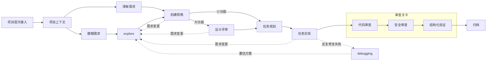

# edan-spec

一套结构化的 AI 辅助软件开发工作流规范，包含 Agent 行为准则、编码规范、技能（Skills）库和文档模板。

## 核心理念

- **先想清楚再动手** — 非平凡任务先出方案，5 分钟确认比 5 小时返工划算
- **拿证据说话** — 通过测试绿、构建过、数据来验证，"看起来对"不算
- **增量开发** — 每个增量独立完成一条验收标准，原子提交
- **一个变更 = 一个目录** — 用 feature 目录聚合所有产物，从文件恢复上下文，不依赖会话记忆

## 目录结构

```
├── AGENT.md                     # Agent 基础规范（核心铁律 + 上下文管理 + 变更工单）
├── CLAUDE.md                    # 项目入口文件（指向 AGENT.md）
├── README.md                    # 项目概览
├── agents/                      # 专家 Agent 定义
│   ├── code-reviewer.md         # 代码审查专家（四维度评估）
│   └── security-reviewer.md     # 安全审查专家（五维度检查）
├── docs/                        # 补充文档
│   ├── anti-patterns.md         # 常见误区与反驳
│   └── git-conventions.md       # Git 操作规范
├── rules/                       # 编码规范
│   ├── common/                  # 通用编码风格（所有语言适用）
│   ├── java/                    # Java 编码风格
│   └── kotlin/                  # Kotlin 编码风格
├── skills/                      # 技能集合
│   ├── project-context/         # 项目上下文初始化（扫描项目 → 生成知识地图）
│   ├── explore/                 # 探索模式（需求澄清 + 方案比较）
│   ├── create-spec/             # 创建 feature 目录 + 生成 proposal/spec/design
│   ├── design-review/           # 复杂功能的正式评审（八章方案 + 八章详细设计）
│   ├── task-plan/               # 任务规划（拆分为可执行任务清单）
│   ├── task-implement/          # 任务实现（TDD 循环 + 原子提交）
│   ├── debugging/               # 调试排障（五步流程）
│   ├── code-review/             # 代码审查（四维度评估）
│   ├── security-review/         # 安全审查（五维度检查）
│   ├── verify/                  # 结构化验证（三维度验收）
│   └── archive/                 # 归档（delta spec 合并 + 文件移动）
└── EdanSpec/                    # 运行时目录（生成产物）
    ├── context/                 # 项目知识地图（运行时生成，持久维护）
    │   ├── project.md           # 项目级上下文
    │   └── modules/             # 模块级设计文档
    │       └── {module-name}/
    │           ├── module.md    # 模块设计（职责边界、类图、时序图）
    │           └── flows/
    │               └── {flow-name}.md  # 业务流设计（输入输出、调用序列）
    ├── feature/                 # 变更工单目录（运行时生成）
    ├── archive/                 # 归档目录（完成后移动）
    └── specs/                   # 主 spec 存储（delta spec 合并后归档于此）
```

## 工作流



**项目入口**：新项目首次接入时先执行 `project-context`，生成知识地图后再进入后续 feature 工作流。

**两个需求入口**：模糊需求走 `explore` 澄清后再进 `create-spec`；清晰需求跳过 `explore` 直接进入 `create-spec`。

**四条回流线**：
1. 需求变更/方向调整 → 回到 `explore` 重新评估
2. `design-review` 完成后 → 回归 `task-plan` 拆分任务
3. `task-implement` 完成后 → 三个审查关卡全部通过才继续归档
4. 同一问题反复修复失败 → 第 1-2 次正常修复；第 3 次停下来重新定位根因（调 `debugging`）；第 4 次回到 `explore` 重新审视方案；第 5 次停止并报告

### 各阶段说明

| 阶段 | Skill | 做什么 |
|------|-------|--------|
| **项目上下文** | `project-context` | 扫描工程项目结构，生成 project.md + module.md + flow.md 知识地图 |
| **探索** | `explore` | 通过反问帮助明确需求，调查代码库，比较方案，不生成文件 |
| **建规格** | `create-spec` | 创建 feature 目录，生成 proposal + spec + design 文档（逐章确认，支持状态恢复） |
| **设计评审** | `design-review` | 大功能/架构变更时执行，产出八章方案文档 + 八章详细设计 |
| **任务规划** | `task-plan` | 按完整功能拆分需求，生成验收标准、验证步骤、工时估算、依赖关系 |
| **任务实现** | `task-implement` | TDD 循环（RED→GREEN→REFACTOR），每个增量独立验证后原子提交，遵循规范体系 |
| **调试排障** | `debugging` | 观察→复现→定位→修复→验证，五步流程，不盲目改代码 |
| **代码审查** | `code-review` | 四维度评估：正确性、可读性、架构、性能 |
| **安全审查** | `security-review` | 五维度检查：输入验证、认证/授权、数据保护、机密管理、依赖安全 |
| **结构化验证** | `verify` | 三维度验收：完整性、正确性、一致性，归档前最终关卡 |
| **归档** | `archive` | delta spec 合并到主规范，feature 移至归档目录 |

## Agent 核心铁律

1. **亮出假设** — 需求模糊时不要脑补，把假设列出来
2. **有疑问就停** — 碰到矛盾时停→说清问题→给选项→等回复
3. **该反对就反对** — 方案有明显问题时指出问题+给替代方案
4. **能简单别复杂** — 无聊的方案 > 聪明的方案
5. **只做分内事** — 只改被要求改的，不"顺手"
6. **拿证据说话** — 测试绿、构建过、数据对

## 上下文管理

在正确的时间加载正确的信息，避免上下文饥饿和泛滥：

- **分层加载** — 规则文件（始终）→ 架构文档（按需）→ 源文件（按任务）→ 错误输出（出错时）
- **逐章生成** — 生成 → 保存 → 展示摘要 → 用户确认 → 释放上下文 → 下一步
- **冲突处理** — 信息冲突时不自己选，报告冲突并给选项
- **内联计划** — 编码前用一两行说明思路，让用户有机会纠偏

详见 [AGENT.md](AGENT.md) 中的完整上下文管理策略。

## Git 规范

遵循 Conventional Commits：`<type>(<scope>): <description>`，原子提交，Trunk-Based 开发，Rebase 优先。详见 [docs/git-conventions.md](docs/git-conventions.md)。

## 规范体系

按文件后缀自动加载对应规范，当前包含：

- 通用规范：[rules/common/coding-style.md](rules/common/coding-style.md)
- Java 规范：[rules/java/coding-style.md](rules/java/coding-style.md)
- Kotlin 规范：[rules/kotlin/coding-style.md](rules/kotlin/coding-style.md)

## 测试覆盖率基线

| 指标 | 基线 |
|------|------|
| 行覆盖率 | ≥ 80% |
| 分支覆盖率 | ≥ 70% |
| 主要路径 | 100% |

## 变更管理

所有代码变更均应通过变更请求（`EdanSpec/feature/{timestamp}-{topic}/`）进行追踪与管理：

- **一个变更 = 一个目录** — 聚合 proposal、specs、design、tasks 等交付物
- **状态驱动** — 从文件系统恢复上下文，不依赖会话记忆
- **tasks.md 是唯一进度来源** — checkbox 格式，驱动 implement 技能
- **status.json 同步** — 每次创建/更新交付物后同步更新 `artifactGraph` 字段
- **完成后归档** — 移至 `EdanSpec/archive/`

详见 [AGENT.md](AGENT.md) 中的变更管理机制。
