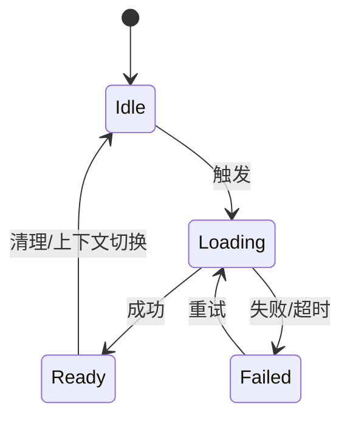
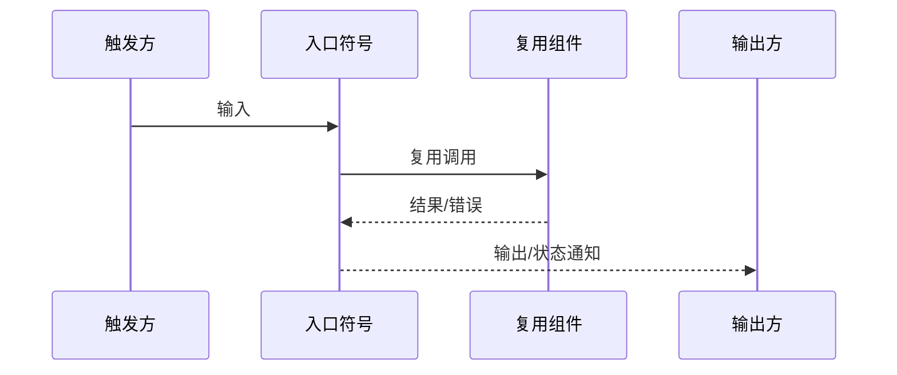

# 实现契约模板

# [项目/功能名称] 实现契约

| 文档属性 | 内容 |
|----------|------|
| 文档版本 | v1.0 |
| 关联方案 | `review/solution.md` 版本或章节 |
| 关联规格 | `specs/*.md` 需求 ID |
| 代码基准 | 分支 + commit；纯新项目填“不适用” |
| 契约状态 | 草稿 / 可规划 / 阻塞 |

## 模板使用规则

- 本文档输出路径仍为 `review/detail.md`，角色是供 `task-plan` 和 `task-implement` 消费的**实现契约**。
- 所有类名、接口名、数据类型、源文件和符号必须来自当前代码、协议或已确认的上游设计。
- 先盘点现有资产，再做“复用 / 扩展 / 新增”判定。不能只写“尽量复用”。
- 每个新增模块、类型、接口、依赖都必须给出代码证据，说明搜索过什么、为什么不能复用或扩展。
- 证据不足、协议冲突、关键字段语义不明时，将契约状态设为“阻塞”，列出待确认项，**阻塞实现**。
- 不适用的表格保留标题并写明理由；删除所有未填写的方括号占位文本。
- 契约 ID 使用 `IC-ASSET-*`、`IC-TRACE-*`、`IC-CHANGE-*`、`IC-DATA-*`、`IC-LIFE-*`、`IC-FLOW-*`、`IC-ENG-*`、`IC-VERIFY-*`，供任务卡引用。

---

## 1. 代码基线与现有资产

### 1.1 工程基线

| 项目 | 实际值 | 验证方式 |
|------|--------|----------|
| 仓库/模块 | [实际路径] | `git rev-parse --show-toplevel` |
| 分支/提交 | [branch / commit] | `git status --short --branch` |
| 构建系统 | [CMake/Gradle/其他] | [实际命令] |
| 测试框架 | [框架] | [实际命令] |
| 相关知识地图 | `EdanSpec/context/...` | [对应模块/业务流] |

### 1.2 现有资产盘点

| 契约 ID | 需求能力 | 现有类/接口/结构体/组件 | 源文件与符号 | 代码证据 | 判定 |
|---------|----------|-------------------------|--------------|----------|------|
| IC-ASSET-001 | [能力] | `[ExistingType]` | `path/file: Symbol` | [搜索命令、调用方、已有测试] | 复用 / 扩展 / 新增 |

### 1.3 新增项证明

仅填写判定为“新增”的项。没有新增项时写“无”。

| 新增对象 | 已检索的现有实现 | 不能复用/扩展的原因 | 新增后的所有者 | 评审结论 |
|----------|------------------|---------------------|----------------|----------|
| `[NewType]` | [路径、符号、搜索词] | [具体能力差距] | [创建、销毁、维护方] | 已批准 / 待确认 |

### 1.4 复用门禁

- [ ] 每项需求都完成了现有资产搜索。
- [ ] 每个新增对象都有不可复用的代码证据。
- [ ] 未创建与现有接口、结构体、工具或状态并行的重复路径。
- [ ] 证据不足的项已进入第 8 章阻塞清单。

---

## 2. 需求到代码追踪

| 契约 ID | 需求 ID | 业务流 | 协议/API | 模块/类 | 源文件与符号 | UI/外部表现 | 测试锚点 |
|---------|---------|--------|----------|---------|--------------|-------------|----------|
| IC-TRACE-001 | FR-001 | IC-FLOW-001 | `[Rpc/Message]` | `[Class]` | `path: symbol` | [属性/控件/输出] | `test/path: case` |

### 2.1 追踪完整性

- 每个需求 ID 至少映射一个业务流和一个验证项。
- 每个业务流必须能反向追踪到需求、代码符号和测试。
- 无法落到真实符号的需求必须标记为新建或阻塞，不得由实现 Agent 自行猜测。

---

## 3. 文件与符号级变更

### 3.1 变更清单

| 契约 ID | 源文件 | 符号 | 变更类型 | 当前行为 | 目标行为 | 复用锚点 | 禁止改变 |
|---------|--------|------|----------|----------|----------|----------|----------|
| IC-CHANGE-001 | `path/file` | `Class::method()` | 新增/修改/复用 | [当前事实] | [精确行为] | `Existing::helper()` | [不在本次范围的行为] |

### 3.2 符号合同

对每个新增或修改的公共符号填写：

| 符号 | 输入 | 输出 | 前置条件 | 副作用 | 失败语义 | 调用方 |
|------|------|------|----------|--------|----------|--------|
| `Class::method(args)` | [类型、范围、单位] | [类型、成功/失败] | [条件] | [缓存/消息/UI/持久化] | [错误码、状态恢复] | [真实调用点] |

### 3.3 变更边界

**允许修改范围：**

- [实际路径/符号及原因]

**禁止修改范围：**

- [明确的模块、公共接口、无关重构]

---

## 4. 端到端数据契约

### 4.1 字段映射

| 契约 ID | 来源字段 | DTO/中间对象 | 领域模型 | UI/输出字段 | 类型/单位 | 空值/未知值 | 转换符号 |
|---------|----------|--------------|----------|-------------|-----------|-------------|----------|
| IC-DATA-001 | `Message.field` | `Dto::field` | `Model::field` | `role/property` | [类型/单位] | [缺失、未知枚举处理] | `convert()` |

### 4.2 数据约束

- **唯一键/关联键**：[组合键及冲突策略]
- **取值范围**：[上下限、精度、单位]
- **时间语义**：[时区、时间戳单位、开始/结束边界]
- **枚举兼容**：[未知枚举、旧版本字段]
- **顺序与去重**：[排序、重复消息、幂等键]

### 4.3 协议一致性门禁

- [ ] 上游协议、生成代码和本契约字段一致。
- [ ] 请求、响应、事件推送已区分。
- [ ] 每个转换步骤都有实际符号和失败策略。
- [ ] 存在版本差异时已确定唯一实现基准；未确定则阻塞实现。

---

## 5. 生命周期、状态与线程

### 5.1 对象生命周期

| 契约 ID | 对象/状态 | 创建者 | 初始化时机 | 更新者 | 清理/销毁时机 | 所在线程 |
|---------|-----------|--------|------------|--------|---------------|----------|
| IC-LIFE-001 | `[Manager/Model/State]` | [符号] | [时机] | [符号] | [切换/退出/异常] | [线程/执行器] |

### 5.2 状态模型

| 状态变化 | 触发 | 守卫条件 | 状态写入符号 | 通知方式 | 失败恢复 |
|----------|------|----------|--------------|----------|----------|
| Idle → Loading | [入口] | [条件] | `path: symbol` | [signal/event] | [恢复] |

### 5.3 并发与异步

| 操作 | 发起线程 | 执行线程 | 回调线程 | 共享状态 | 同步/防重入 | 过期响应处理 |
|------|----------|----------|----------|----------|-------------|--------------|
| [操作] | [线程] | [线程] | [线程] | [状态] | [队列/锁/token] | [版本号/上下文校验] |

---

## 6. 业务流实现合同

每个独立触发链路复制一节。状态推送、详情拉取、用户修改、接受、拒绝、配置变化等不得挤在同一条总流程中。

### 6.1 IC-FLOW-001：[业务流名称]

- **关联需求**：FR-001
- **入口符号**：`path: Class::method()`
- **前置条件**：[配置、状态、权限、上下文]
- **输入**：[字段、类型、约束]
- **处理步骤**：
  1. [调用真实符号]
  2. [转换/校验/更新]
  3. [通知或输出]
- **输出**：[返回、事件、UI状态]
- **状态变化**：[引用 IC-LIFE-*]
- **副作用**：[消息、持久化、设备设置、缓存]
- **失败处理**：[超时、错误、状态恢复、用户感知]
- **幂等/防重入**：[策略]
- **测试锚点**：[测试路径、用例、fixture/mock]

---

## 7. 工程接入

### 7.1 构建/资源清单

| 契约 ID | 类型 | 文件/键/目标 | 变更 | 默认行为 | 关闭/回滚验证 |
|---------|------|--------------|------|----------|---------------|
| IC-ENG-001 | 构建/资源/注册/配置 | [路径或键] | [新增/修改] | [默认值] | [验证命令] |

必须按项目实际检查：

- 构建源文件列表、链接依赖和生成代码。
- Feature Flag、编译宏和默认关闭/开启行为。
- UI/QML/路由/反射/依赖注入注册。
- QRC、图片、翻译和其他资源。
- Mock、测试数据和正式后端的切换边界。
- 初始化顺序、模块装配和发布/回滚影响。

### 7.2 兼容与迁移

| 兼容维度 | 当前行为 | 目标行为 | 兼容策略 | 回滚方式 | 验证 |
|----------|----------|----------|----------|----------|------|
| 接口/数据/配置/平台 | [事实] | [变化] | [策略] | [方式] | [命令/用例] |

---

## 8. 验证合同与实现门禁

### 8.1 验证合同

| 契约 ID | 需求/业务流 | 测试层级 | 测试文件/用例 | 前置数据 | 命令 | 预期证据 |
|---------|-------------|----------|---------------|----------|------|----------|
| IC-VERIFY-001 | FR-001 / IC-FLOW-001 | 单元/集成/UI | `path: case` | [fixture/mock] | `[exact command]` | [退出码/断言/截图] |

### 8.2 UI 与人工验收

- 可自动化的 UI 必须给出 lint、组件测试、截图或视觉回归命令。
- 暂时无法自动化的视觉/设备验收必须列出操作步骤、预期结果和责任人，并保持“未完成”，不得静默跳过。
- 构建或单元测试通过不能替代视觉、设备或端到端验收。

### 8.3 阻塞清单

| 编号 | 未闭合问题 | 影响的契约 ID | 需要的证据/决策 | 责任人 | 状态 |
|------|------------|----------------|-----------------|--------|------|
| BLOCK-001 | [协议/代码/需求冲突] | [ID] | [需要确认什么] | [角色] | 阻塞/已解决 |

存在以下任一情况时，契约状态必须为“阻塞”，`task-plan` 不得生成对应编码任务，`task-implement` 不得开始编码：

- 关键需求没有代码/测试追踪。
- 新增对象没有复用评估和代码证据。
- 协议字段、单位、枚举或失败语义存在冲突。
- 源文件、符号或生命周期所有者无法确认。
- 验证命令不可执行且没有明确的人工验收责任。

### 8.4 完成检查

- [ ] 所有需求 ID 均可追踪到代码符号和验证合同。
- [ ] 所有新增项均通过复用门禁。
- [ ] 字段、生命周期、线程和失败处理已经闭合。
- [ ] 构建/资源接入和 Feature Flag 已列全。
- [ ] 阻塞清单为空或全部已解决。
- [ ] 契约状态已设置为“可规划”。
