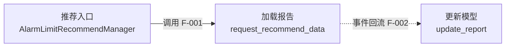

# 知识地图证据契约

所有 L0-L4 图谱都必须区分机器事实、图启发式、AI 推断和未知项。

## 证据状态

| 状态 | 含义 | 允许来源 | Mermaid 表达 |
|------|------|----------|--------------|
| `Verified` | 静态关系或源码直接证明 | CodeGraph 明确静态边、源码、构建/配置 | 实线 |
| `Graph-Heuristic` | CodeGraph 标为动态分派、合成或启发式关系 | CodeGraph relationship map/provenance | 虚线 |
| `Inferred` | AI 根据多个事实推导，未直接证明 | 命名、目录聚类、文档与间接证据 | 虚线并标“推断” |
| `Unknown` | 当前证据不足或工具不支持 | QML/宏/反射/配置装配等缺口 | 点线连接“待确认”节点 |

不要用搜索 score 代替证据状态或置信度。

## Evidence ID

每个文档内 Evidence ID 必须唯一：

- L0：`P-001`
- L1：`M-001`
- L2/L3：`F-001`
- L4：`I-001`

图中重要边在标签末尾附 Evidence ID：

## 证据表

每个文档至少包含：

| Evidence ID | 事实/关系 | 来源 | 定位 | 证据状态 | 置信度 | 备注 |
|-------------|-----------|------|------|----------|--------|------|
| F-001 | A 调用 B | CodeGraph / Source / Config / Existing Doc | `path:line` 或 `Class::method` | Verified | High | 方向 caller→callee |

受控置信度：

- `High`：源码或静态图边直接证明。
- `Medium`：CodeGraph 启发式关系，或多项独立证据支持。
- `Low`：命名/目录/文档推断，仍需人工确认。

`Unknown` 的置信度写 `N/A`。

## 最低证据覆盖

- L0：所有跨模块边必须有 Evidence ID。
- L1：所有入口、公共接口、数据写入和跨模块依赖必须有 Evidence ID。
- L2：入口、每个关键跳转、数据/外部副作用、结果返回必须有 Evidence ID。
- L4：每个直接影响必须 Verified 或 Graph-Heuristic；间接风险可以 Inferred。

无法满足时不要删除真实节点来提高覆盖率；保留节点并降级状态。

## 已知盲区

按项目实际检查：

- 反射、依赖注入和服务定位
- Qt signal/slot、`Q_PROPERTY`、`Q_INVOKABLE`
- QML 与 C++ 绑定
- 宏和条件编译
- 生成代码、protobuf、IDL
- 配置驱动装配
- 事件 ID 路由和消息总线
- 函数指针、`std::function`、回调
- 动态加载和插件

盲区表：

| 盲区 | 影响的图/关系 | 当前状态 | 补证方法 |
|------|---------------|----------|----------|
| {机制} | {Evidence ID 或节点} | Unknown | {定向源码/运行时/人工确认} |
