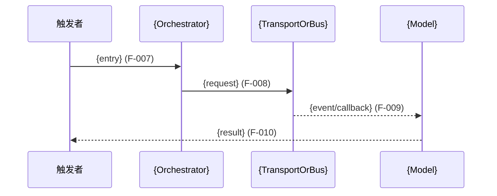

# Flow: {FlowName}

## 这张图回答什么问题

{2-4 句话说明触发者、业务目标、结束状态和图中不展开的范围。}

## 入口、结果与前置条件

- **入口**：`{UI action / API / event / Class::method}`
- **输入**：`{InputType}`（{key fields}）
- **结果**：`{OutputType / UI state / event}`
- **副作用**：{write/publish/external call or None}
- **前置条件**：{conditions}

## L2 主流程

```mermaid
flowchart LR
    A[用户/事件入口<br/>{Entry}] -->|调用 F-001| B[业务编排<br/>{Orchestrator}]
    B -->|读取 F-002| C[领域状态<br/>{Model}]
    B -->|发送 F-003| D[外部边界<br/>{Transport}]
    D -.->|事件回流 F-004| E[更新结果<br/>{UpdateSymbol}]
```

### 图例

- 实线：Verified
- 虚线：Graph-Heuristic / Inferred
- 点线到“待确认”：Unknown

> L2 只描述一个业务场景，保持 8-20 个关键节点。流程专属、跨模块和外部节点不要求全部出现在 L1，但必须写明归属和证据。

## 阶段与业务规则

| 阶段 | 业务动作 | 输入→输出 | 失败行为 | Evidence ID |
|------|----------|-----------|----------|-------------|
| {stage} | {action} | `{input}` → `{output}` | {fail-closed/retry/error} | F-005 |

## 参与构件

| 工程职责 | 代码符号 | 模块归属 | L1 状态 | Evidence ID |
|----------|----------|----------|---------|-------------|
| {responsibility} | `{Symbol}` | {module/external} | L1 core / flow-only / external | F-006 |

> 新发现的模块核心构件应增量更新 L1。辅助节点保留为 `flow-only`，不要为了子集约束污染 L1。

## 调用与事件序列



> 区分直接调用、异步事件、回调和推断跳转。无法证明的动态跳转不得使用普通实线。

## 数据流与副作用

| 数据形态 | 来源 | 去向 | 转换/关键字段 | 副作用 | Evidence ID |
|----------|------|------|---------------|--------|-------------|
| `{Type/JSON/Proto/Domain}` | {source} | {target} | {mapping} | {write/publish/none} | F-011 |

## 异常、事务与并发

| 失败点 | 处理方式 | 可恢复性 | 影响范围 | Evidence ID |
|--------|----------|----------|----------|-------------|
| {failure} | {return/retry/rollback/log} | 可恢复/不可恢复/Unknown | {scope} | F-012 |

性能、事务或并发数值没有证据时写 `Unknown`，不要猜测。

## L3 证据

| Evidence ID | 事实/关系 | 来源 | 定位 | 证据状态 | 置信度 | 备注 |
|-------------|-----------|------|------|----------|--------|------|
| F-001 | {fact} | CodeGraph / Source / Config / Existing Doc | `{path:line or symbol}` | Verified | High | caller→callee |

## 已知盲区

| 盲区 | 影响的步骤/关系 | 当前状态 | 补证方法 |
|------|-----------------|----------|----------|
| {event/callback/QML/macro/config} | {F-xxx} | Unknown | {targeted source/runtime/manual check} |

## 验证建议

- 自动化测试：{test path/command or Unknown}
- 人工验证：{runtime scenario}
- 修改前建议生成的 L4：{target symbols}
