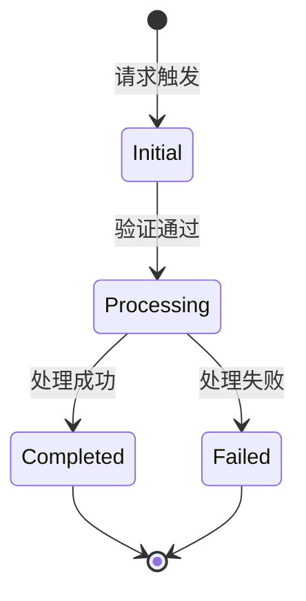
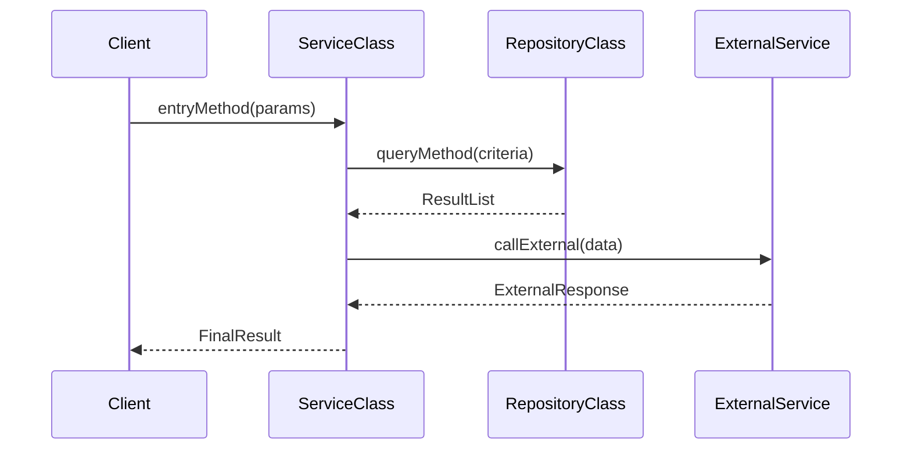

# Flow: {FlowName}

## 概述

{业务流一句话描述，解决什么问题。为什么存在这个业务流？}

## 前置条件

- {执行此业务流前，系统必须满足的状态或条件}
- {例如：用户已登录、订单状态为待支付、目标资源存在且未被锁定}

## 输入输出

- **输入**：`{InputType}`（{字段说明}）
- **输出**：`{OutputType}`（{字段说明}）
- **副作用**：{如有副作用（写库、发消息、调外部服务），明确列出}

## 状态机



> 若业务流无明确状态机（如纯查询流程），删除本节，替换为「流程阶段」段落。

## 流程阶段（无状态机时替代）

1. **阶段一**：{描述}
2. **阶段二**：{描述}
3. **阶段三**：{描述}

## 业务规则

| 规则 | 说明 | 违反时的行为 |
|------|------|--------------|
| {规则名} | {例如：单笔金额上限 10 万} | {返回错误 / 拒绝 / 截断} |

> 列出此业务流特有的领域约束和校验规则。通用参数校验（如非空、格式）无需列出。

## 涉及的类与接口

| 类/接口 | 类型 | 职责 |
|---------|------|------|
| `{ClassName}` | Service / Repository / Controller / Domain / DTO | {一句话职责} |

> 列出业务流中所有核心类（入口类、服务类、仓库类、领域类），不列工具类。
> **必须是所属 module.md 类图的子集**，不得出现 module.md 未提及的类。

## 接口调用序列



> 展示**完整的调用链**（从入口到返回），包括外部服务调用。使用实际类名作为 participant 名称。
> **与「数据流」的区别**：本节关注「谁调用了谁、同步/异步、异常在哪里捕获」；数据流关注「数据格式转换和关键字段」。

## 数据流

```mermaid
graph LR
    Client -->|InputDTO<br/>{key fields}| Service
    Service -->|QueryCriteria<br/>{filters}| Repository
    Repository -->|EntityList<br/>{entities}| Service
    Service -->|OutputDTO<br/>{result fields}| Client
```

> 标注**数据格式**（JSON / Protobuf / Domain Object / DTO）和**关键字段**。
> **与「接口调用序列」的区别**：本节关注「数据形态如何在各层之间转换」，不关注调用顺序和异常点。

## 异常处理

| 异常场景 | 异常类型 | 处理方式 | 影响范围 |
|----------|----------|----------|----------|
| {场景} | {ExceptionType} | {重试 / 降级 / 返回错误 / 记录日志} | {只影响当前请求 / 影响后续流程} |

> 覆盖主流程中的关键失败点。区分「可恢复异常」和「不可恢复异常」。

## 事务与幂等性

| 属性 | 值 | 说明 |
|------|-----|------|
| 事务边界 | {方法级 / 服务级 / 无} | {哪些操作在同一事务中} |
| 幂等性 | {是 / 否} | {如何实现幂等：唯一键去重 / Token 机制 / 状态机幂等} |
| 分布式锁 | {是 / 否} | {锁的粒度：用户级 / 订单级 / 资源级} |

> 若本业务流无事务或并发特殊要求，删除本节。

## 性能与并发

| 属性 | 值 | 说明 |
|------|-----|------|
| 预期响应时间 | {N ms} | {说明} |
| 并发限制 | {N QPS / 无限制} | {说明} |
| 是否需要事务 | {是/否} | {说明} |

> 若性能无特殊要求，删除本节。
