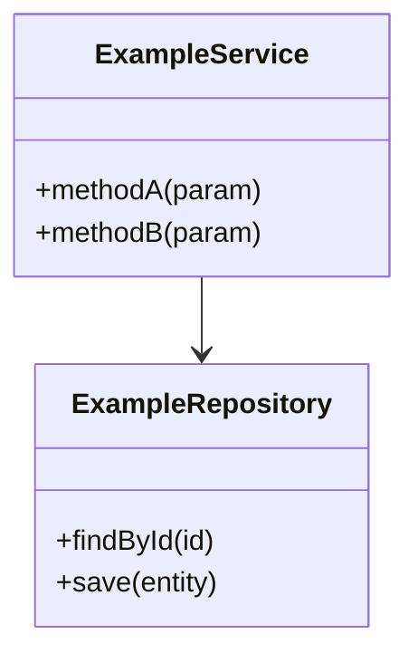
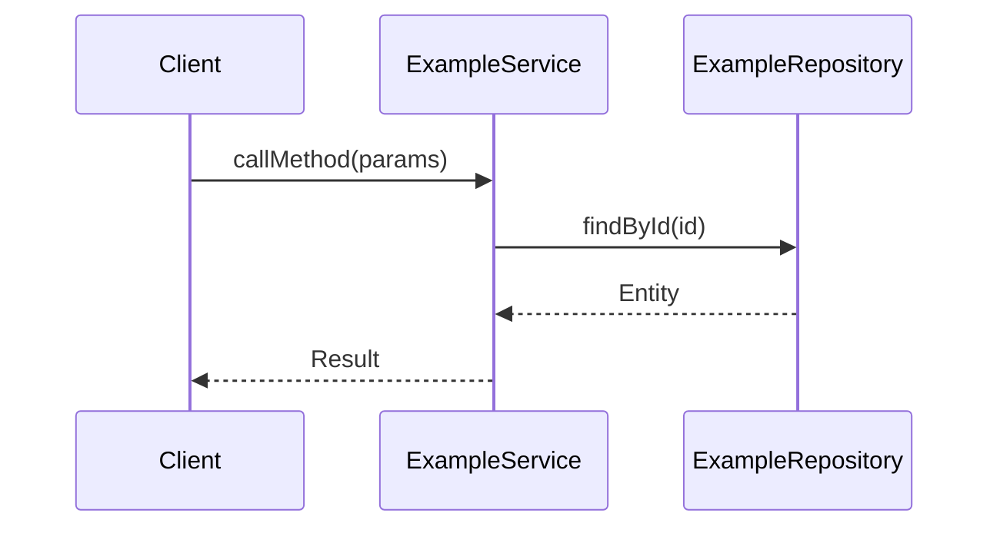
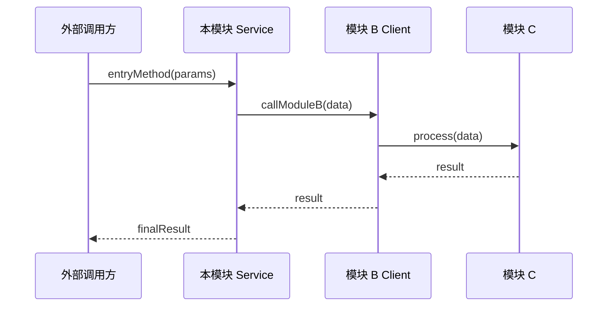
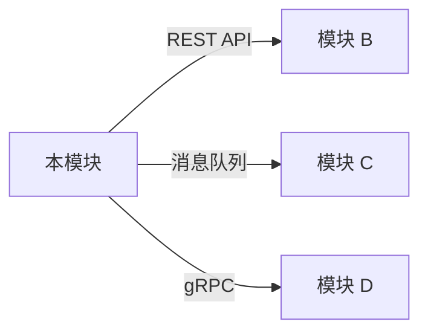

# Module: {ModuleName}

## 职责边界

- **负责**：
  - {职责 1}
  - {职责 2}
- **不负责**：
  - {明确排除的职责 1（由 {other-module} 负责）}
  - {明确排除的职责 2}

> 边界模糊是后续 feature 冲突的主要来源，务必明确"不负责"的范围。

## 公共接口

| 接口/端点 | 协议 | 调用方 | 用途 |
|-----------|------|--------|------|
| `{API/MethodName}` | {REST / gRPC / 内部方法} | {模块 X / 前端} | {一句话用途} |

> 列出模块对外暴露的主要入口。REST 接口写 path，内部方法写类名.方法名。

## 数据模型

| 实体/表名 | 用途 | 关键字段 |
|-----------|------|----------|
| `{EntityName}` | {用途} | `{id}`, `{name}`, `{status}` |

> 列出模块核心的领域实体或数据库表。无需画 ER 图，用表格说明即可。

## 类图

> 类图只包含模块内核心类（≤10 个），省略工具类、DTO、常量类。标注类之间的关键关系（继承、实现、依赖）。

## 时序图：{模块内核心场景}

> **只画 1 个最核心场景，且调用链应限制在本模块内部**。其他场景在「其他场景」段落用文字描述，不画时序图。

## 跨模块场景

> **当最核心场景必须跨模块协作时，将跨模块时序图画在此节**，而非「模块内核心场景」中。本节的调用链可跨越模块边界。

## 其他场景

- **场景 B**：{描述} → 涉及的类：{ClassA}、{ClassB}
- **场景 C**：{描述} → 涉及的类：{ClassC}

## 模块交互

> 标注调用方向（同步/异步）、通信协议（REST/gRPC/消息队列/Direct Call）。
> **本图应与 project.md 的「架构概览」保持一致**。

## 配置项

| 配置项 | 默认值 | 说明 |
|--------|--------|------|
| `{config.key}` | `{default}` | {说明} |

> 模块级别的特殊配置（feature flag、阈值、超时等）。通用配置无需列出。

## 业务流索引

| 业务流 | 设计文档 | 描述 |
|--------|----------|------|
| {flow-name} | [flows/{flow-name}.md](flows/{flow-name}.md) | {一句话描述} |

> 每个业务流对应一个 flow.md。业务流是模块内相对独立的业务流程，不是任意一个方法调用。
> 若模块无独立业务流，写「本模块无独立业务流」并删除下方 flows/ 目录。
