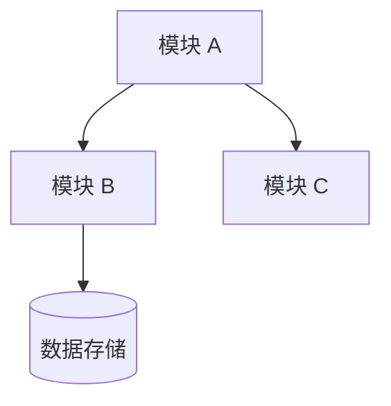

# Project: {project-name}

## 项目目标

{1-2 句话说明本项目解决什么问题，核心价值是什么。}

## 基本信息

| 属性 | 值 |
|------|-----|
| 名称 | {name} |
| 项目类型 | {monolith / microservice / frontend / library} |
| 技术栈 | {tech-stack} |
| 构建工具 | {build-tool} |
| 包结构/根命名空间 | {root-package} |

> 技术栈应包含关键框架及其版本号，如 `Spring Boot 3.2.x`、`Vue 3.x`。

## 基础设施

| 类型 | 技术/服务 | 用途 |
|------|-----------|------|
| 数据库 | {MySQL / PostgreSQL / MongoDB / ...} | {用途} |
| 缓存 | {Redis / Memcached / ...} | {用途} |
| 消息队列 | {Kafka / RabbitMQ / ...} | {用途} |
| 外部服务 | {服务 A} | {用途} |

> 只列出全局共享的基础设施。模块专属的中间件在 module.md 中说明。

## 架构概览

> 架构概览只画模块级节点，不画类级细节。每个节点标注模块名和核心职责（≤10 字）。
> **本图是模块间关系的权威来源**，module.md 中的「模块交互」应与之保持一致。

## 模块索引

| 模块 | 源码路径 | 设计文档 | 职责简述 |
|------|----------|----------|----------|
| {module-name} | `{source-path}` | [module.md](modules/{module-name}/module.md) | {一句话职责} |

> 模块命名使用 kebab-case，如 `alarm-manager`、`data-collector`。
