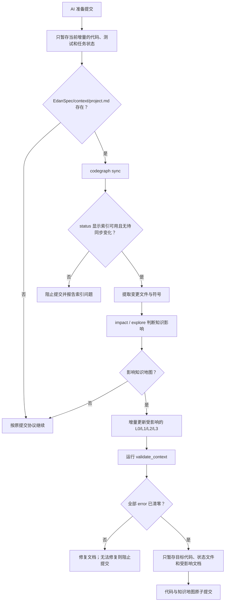

# AI 提交时自动同步 Project Context 设计

## 1. 目标

当 AI 准备提交代码时，自动检测项目是否存在 `EdanSpec/context/`。若本次代码修改会影响知识地图，AI 必须先同步 CodeGraph 索引、增量更新受影响的 L0/L1/L2/L3 文档、完成确定性校验，再提交代码。

目标是让代码与面向工程师的知识地图保持一致，同时避免无关修改导致文档抖动。

## 2. 范围

### 2.1 包含

- Claude Code、OpenCode、Kilo Code 的 AI 提交协议。
- `task-implement` 串行和并行提交路径。
- `project-context` 的提交影响检测模式。
- CodeGraph 1.5.0 索引同步、状态检查、影响分析和调用链查询。
- 代码与受影响知识地图的原子提交。
- Linux 内网环境从 CodeGraph 0.2.5 升级到 1.5.0 的离线交付与迁移说明。

### 2.2 不包含

- 为所有人工 Git 提交安装强制 Hook。
- 在普通 `git commit` Hook 中调用模型。
- 无 `EdanSpec/context/` 项目自动创建完整知识地图。
- 自动删除或重建已有知识地图。
- 同时维护 CodeGraph 0.2.5 和 1.5.0 两套命令契约。

## 3. 核心决策

### 3.1 AI 提交协议是主触发器

闭环嵌入所有平台的 AI 提交规范，而不是依赖开发者机器上的 Git Hook。AI 只要准备执行提交，就必须运行 Project Context Gate。

### 3.2 Claude Code 是唯一源码

提交协议和相关 Skill 只在 `claudecode/.claude/` 中人工维护：

- `CLAUDE.md`：全局 AI 提交协议。
- `skills/task-implement/SKILL.md`：实现流程中的提交门禁。
- `skills/task-implement/references/parallel-execution.md`：并行聚合规则。
- `skills/project-context/SKILL.md`：提交影响检测和 Update 模式。
- `skills/project-context/scripts/`：确定性检测与验证脚本。

OpenCode 和 Kilo Code 不接受独立手工修改。构建离线包时：

1. Claude Code 内容适配为 OpenCode 路径、命名和 Agent 元数据。
2. Kilo Code 从已适配的 OpenCode staging 确定性派生。
3. 派生测试验证三个平台包含等价提交协议。
4. 任一平台出现协议缺失、路径泄漏或语义漂移时禁止打包。

### 3.3 统一 CodeGraph 1.5.0

提交闭环只使用以下命令契约：

```text
codegraph sync <projectPath>
codegraph status <projectPath> --json
codegraph explore "<query>" --path <projectPath> --max-files <N>
codegraph impact <symbol> --path <projectPath> --depth <N> --json
```

内网现有 0.2.5 索引不复用。升级前备份旧 `.codegraph*`，安装 1.5.0 后重新执行 `codegraph init`。

## 4. 提交闭环



## 5. Project Context Gate

### 5.1 输入

- 项目绝对路径。
- `git diff --cached --name-status`。
- `EdanSpec/context/` 当前文档。
- CodeGraph 1.5.0 状态和影响分析结果。

以暂存差异作为提交范围的唯一事实来源。工作区其他未暂存修改不得进入影响判断或提交。

### 5.2 快速跳过

满足任一条件时可记录原因后跳过更新：

- `EdanSpec/context/project.md` 不存在。
- 本次仅修改 `EdanSpec/context/` 本身。
- 仅修改空白、格式或无语义注释。
- 仅修改测试内部结构，且未改变被记录的测试策略、公共夹具或工程入口。
- 修改文件不属于任何已记录模块、业务流、公共接口、数据契约、配置或外部系统边界。

跳过结果必须写入 AI 提交摘要，但不生成额外状态文件。

### 5.3 必须更新

出现以下任一变化时必须运行 Update：

- 新增、删除、拆分、合并或重命名模块。
- 新增、删除或改变公共接口、协议、入口或外部系统调用。
- 核心构件、调用方向、数据流或状态转换发生变化。
- 数据模型、序列化格式、配置装配、构建关系或运行时依赖变化。
- CodeGraph impact 显示现有 L1/L2 证据引用的符号或调用边受到影响。
- 已记录 Evidence 指向的源码路径被移动、删除或改变语义。

### 5.4 不确定影响

CodeGraph 无法证明动态路径时，AI采用保守策略：

- 更新受影响文档中的盲区或风险说明。
- 关系证据使用 `Graph-Heuristic` 或 `Unknown`。
- 不把静态图推断冒充 `Verified`。
- 若无法确定模块边界或会导致大范围文档重写，暂停提交并请求工程师确认。

## 6. 增量更新策略

### 6.1 反向定位

AI按以下顺序定位受影响文档：

1. 在现有证据表中匹配变更文件、符号和 Evidence ID。
2. 用 `impact` 获取直接和间接影响。
3. 用 `explore` 补充业务入口到结果的调用链。
4. 根据模块索引和业务流索引确定 L0/L1/L2 更新集合。

不生成全库大图，不因私有实现细节调整而重写整个模块文档。

### 6.2 更新顺序

```text
L3 证据变化
  → 检查对应 L2 业务流
  → 检查对应 L1 模块
  → 只有模块边界或跨模块关系改变时才更新 L0
```

废弃文档保留并标注原因和日期。删除或全量重建仍需要用户明确授权。

### 6.3 校验

更新后必须执行：

```bash
python .claude/skills/project-context/scripts/validate_context.py \
  "<projectPath>/EdanSpec/context" --json
```

还需检查：

- 受影响 Evidence 的路径和符号仍存在。
- Mermaid 重要边引用当前文档定义的 Evidence ID。
- `Verified` 关系拥有可定位源码证据。
- L0/L1/L2 链接和索引一致。
- 图谱节点上限未超出。

任何 error 阻止提交；warning 必须出现在提交摘要中。

## 7. 串行与并行提交

### 7.1 串行增量

每个增量执行：

```text
TDD → 代码验证 → Project Context Gate → 原子提交 → 更新任务状态
```

代码、任务状态和受影响知识地图进入同一个提交。

### 7.2 并行 worktree

并行 worktree 中的子 Agent提交只作为主 Agent收集结果的临时传输提交，不是进入目标分支的交付提交。子 Agent不独立修改共享知识地图，避免多分支同时改写同一 L0/L1 文档。

流程为：

1. 子 Agent完成代码和测试的临时传输提交，并在交付摘要中列出变更文件、核心符号和可能影响。
2. 主 Agent使用不直接形成交付提交的方式聚合并行结果，例如 `cherry-pick --no-commit`。
3. 主 Agent 对聚合后的净变化统一运行 Project Context Gate。
4. 主 Agent把聚合代码、任务状态和 context 文档形成一个目标分支原子提交。
5. 聚合验证未通过时不得宣布并行任务完成。

目标分支不得保留缺少 context 同步的并行代码提交。临时 worktree 提交不会直接推送或合并到交付分支。

## 8. 多平台协议同步

### 8.1 Claude Code

在全局提交规则和 `task-implement` 中明确 Project Context Gate。Claude Agent 使用 `.claude/...` 路径和 `edanspec:*` Skill 名称。

### 8.2 OpenCode

派生时适配：

- `.claude/` → `.opencode/`
- `edanspec:*` → `edanspec-*`
- Claude Agent frontmatter → OpenCode subagent 元数据

OpenCode 的全局提交规则、`edanspec-task-implement` 和 `project-context` 必须包含相同门禁语义。

### 8.3 Kilo Code

Kilo 从 OpenCode staging 派生：

- `.opencode/` → `.kilo/`
- 保留连字符 Skill 名称
- 生成 Kilo 可发现的 subagent 元数据
- 根 `AGENTS.md` 包含同等提交协议

### 8.4 派生验收

自动化测试必须验证：

- 三个平台均出现“提交前检测 context”的协议。
- 三个平台均包含 CodeGraph 1.5.0 命令。
- OpenCode/Kilo 不残留 `.claude/` 或 `edanspec:`。
- Kilo 不残留 `.opencode/`。
- 三个平台的跳过、阻断、并行聚合语义一致。
- 打包后重新解压，manifest 和 SHA-256 完整通过。

## 9. CodeGraph 内网升级

已确认内网目标环境：

| 属性 | 值 |
|------|----|
| 操作系统 | Ubuntu 22.04 |
| CPU 架构 | `x86_64` |
| CodeGraph 目标版本 | `1.5.0` |
| 官方资产 | `codegraph-linux-x64.tar.gz` |

不得下载或交付 `codegraph-linux-arm64.tar.gz`。

交付 Linux 离线安装包，至少包含：

- CodeGraph 1.5.0 Linux x64 运行包。
- 安装和回滚说明。
- SHA-256 校验文件。
- 0.2.5 索引迁移检查表。

迁移步骤：

1. 记录 `codegraph --version` 和旧索引路径。
2. 备份旧 `.codegraph*`，不得直接删除。
3. 离线安装 1.5.0。
4. 确认 `codegraph --version`。
5. 在项目根目录重新执行 `codegraph init`。
6. 用 `codegraph status --json` 验证索引状态。
7. 配置对应 AI 平台的 MCP 后重启客户端。
8. 对一个已知符号执行 `explore` 和 `impact` 冒烟验证。

旧版本可执行文件和数据库保留到新版本冒烟测试通过后再由工程师决定清理。

## 10. 错误处理

| 场景 | 行为 |
|------|------|
| CodeGraph 未安装 | context 存在时阻止 AI 提交，输出安装指引 |
| 索引未初始化 | 阻止提交，建议执行 `codegraph init` |
| `sync` 失败或状态异常 | 阻止提交，不基于陈旧索引更新文档 |
| 影响分析无结果 | 使用证据路径和小范围源码检查；仍不确定则标记 Unknown |
| 文档更新范围异常扩大 | 暂停并请求工程师确认模块边界 |
| `validate_context` 有 error | 自动修复；无法修复则阻止提交 |
| 派生平台协议不一致 | 阻止离线包生成 |
| 并行 Agent 修改同一 context 文件 | 放弃子 Agent 文档修改，由主 Agent重新聚合生成 |

## 11. 测试策略

### 11.1 确定性单元测试

- context 不存在时跳过。
- 仅格式变化时跳过。
- 公共接口、模块路径和业务流入口变化时要求更新。
- 已记录 Evidence 文件删除时要求更新。
- CodeGraph 状态异常时阻止提交。
- validator error 阻止提交。

### 11.2 Skill 行为测试

- AI 面对“赶时间，直接提交”压力时仍执行门禁。
- AI 不因私有实现变更重写全量知识地图。
- AI 不把影响分析当成业务调用链。
- AI 在动态关系证据不足时使用 `Graph-Heuristic/Unknown`。
- AI 只暂存当前增量和对应 context 文件。

### 11.3 集成测试

- 构造一个已有 context 的小型仓库，修改公共接口后验证文档与代码同提交。
- 构造无影响修改，验证不产生 context 抖动。
- 构造并行 worktree，验证主 Agent 聚合更新且无 context 冲突。
- 构建三个平台离线包并重新解压验证协议一致性。

## 12. 验收标准

- 所有进入目标分支的 AI 代码提交都执行 Project Context Gate。
- 无 `EdanSpec/context/project.md` 时不阻塞正常提交。
- 有明确知识影响时，提交前自动增量更新受影响文档。
- CodeGraph 或 context 校验失败时不会产生 AI 提交。
- 串行与并行代码进入目标分支时都与受影响 context 文档原子提交。
- Claude Code 是唯一人工维护源码。
- OpenCode 和 Kilo Code 的提交协议通过确定性派生获得且语义一致。
- 内网 CodeGraph 统一为 1.5.0，并完成重新索引和冒烟验证。
