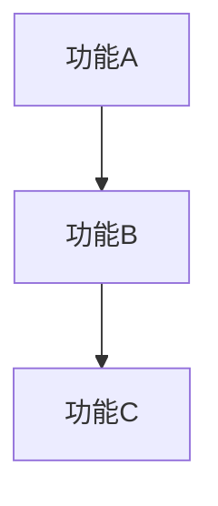
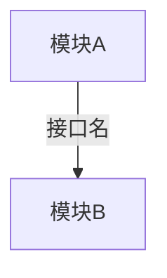
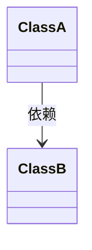
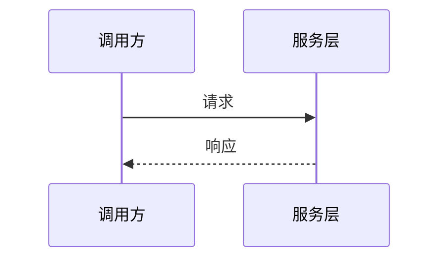
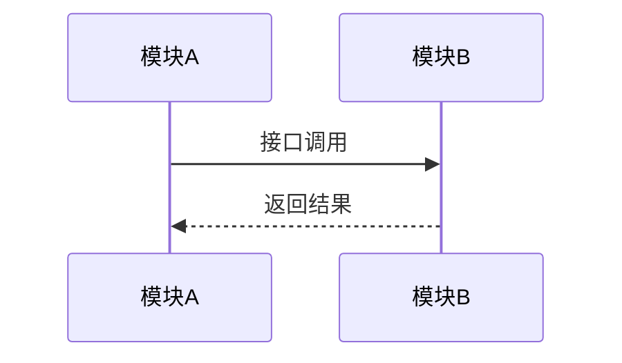

# 方案设计文档模板

## 文档结构（8 章节 + 每模块 7 子章节）

1. **引言** 
2. **需求定义** 
3. **需求分解** 
4. **方案设计**
5. **自测用例** 
6. **集成计划** 
7. **工作量评估** 
8. **附录**

每个模块 7 个子章节：模块描述 → 业务处理流程 → 并发与同步 → 异常处理 → 影响分析 → 兼容性分析 → 重要设计决策

> 逐章节生成，避免上下文膨胀。详见 `AGENT.md` 中的「上下文管理」章节。

---

# [项目名称] 方案设计文档

**版本**: v1.0 | **日期**: YYYY-MM-DD | **作者**: [作者]

---

## 目录

1. [引言](#1-引言) · 2. [需求定义](#2-需求定义) · 3. [需求分解](#3-需求分解)
4. [方案设计](#4-方案设计) · 5. [自测用例](#5-自测用例) · 6. [集成计划](#6-集成计划)
7. [工作量评估](#7-工作量评估) · 8. [附录](#8-附录)

---

## 1. 引言

### 1.1 背景

**项目背景**: [简要描述项目的背景和目标]

### 1.2 定义

| 术语 | 定义 | 说明 |
|------|------|------|
| **术语** | 定义 | 补充说明 |

---

## 2. 需求定义

### 2.1 需求来源

**需求发起方**: [谁提出的]
**需求背景**: [为什么做这个需求]

### 2.2 需求目标

**核心问题**: [项目要解决的核心问题，1-3 条]

### 2.3 需求优先级

**核心需求**:

| 需求ID | 需求描述 | 优先级 | 验收标准 |
|--------|---------|--------|---------|
| FR-001 | 功能描述 | P0 | 可测量的验收标准 |

**扩展需求**:

| 需求ID | 需求描述 | 优先级 | 验收标准 |
|--------|---------|--------|---------|
| FR-00N | 扩展功能 | P1 | 验收标准 |

---

## 3. 需求分解

### 3.1 功能分解

| 功能ID | 功能名称 | 功能描述 | 所属模块 |
|--------|---------|---------|---------|
| F-001 | 功能名称 | 功能描述 | M-001 模块名 |

### 3.2 功能依赖关系

---

## 4. 方案设计

### 4.1 模块架构总览

**模块划分策略**: [说明划分原则]

**模块列表**:

| 模块ID | 模块名称 | 模块职责 | 核心类数量 | 依赖模块 |
|--------|---------|---------|-----------|---------|
| M-001 | 模块名 | 职责描述 | N个 | 无/M-00X |

**模块架构图**:

**模块间接口定义**:

| 接口名称 | 提供方模块 | 调用方模块 | 接口方法 | 接口说明 |
|---------|-----------|-----------|---------|---------|
| I-001 | M-00X | M-00Y | `methodName(params)` | 说明 |

---

### 4.2 模块1：[模块名称]

**模块 ID**: M-001
**模块职责**: [一句话]

#### 4.2.1 模块描述

| 类名 | 职责 | 依赖关系 | 文件路径 |
|------|------|---------|---------|
| **ClassName** | 职责 | 依赖 XxxService | `src/module/Class.h` |

**关键接口定义**: [列出公开接口]

**模块数据流**:

#### 4.2.2 业务处理流程

**业务步骤**: 1. 步骤一；2. 步骤二；3. 步骤三。

| 决策点 | 决策内容 | 决策理由 |
|-------|---------|---------|
| 决策名称 | 选择什么 | 为什么这样选 |

#### 4.2.3 并发与同步

| 异步任务 | 异步框架 | 线程策略 | 性能要求 |
|---------|---------|---------|---------|
| 任务名 | 框架 | 策略 | 指标 |

#### 4.2.4 异常处理

| 异常类型 | 异常场景 | 处理策略 | 用户提示 |
|---------|---------|---------|---------|
| 异常类型 | 触发条件 | 如何处理 | 提示文案 |

#### 4.2.5 影响分析

| 模块名称 | 影响评估 | 影响说明 |
|---------|---------|---------|
| M-00X | ✅/⚠️ | 具体影响 |

#### 4.2.6 兼容性分析

**软件兼容性**: [兼容版本/平台要求]
**数据兼容性**: [与旧版本数据的兼容情况]

#### 4.2.7 重要设计决策

| 替代方案 | 优点 | 缺点 | 结论 |
|---------|------|------|------|
| 方案A | ... | ... | ❌ |
| **方案B** | ... | ... | ✅ **采用** |

---

### 4.3 模块2：[模块名称]

**模块 ID**: M-002
**模块职责**: [一句话]

> 按模块 1 的 7 个子章节结构填写。表格列数保持一致。

---

### 4.N 跨模块协作

---

## 5. 自测用例

| 用例ID | 用例名称 | 所属模块 | 测试步骤 | 预期结果 |
|--------|---------|---------|---------|---------|
| TC-001 | [功能名称] | [模块] | [步骤] | [结果] |

> 覆盖 P0 核心功能。边界测试覆盖空数据、超长、网络异常。每个功能至少 1 条。

## 6. 集成计划

| 步骤 | 步骤名称 | 所属模块 | 依赖步骤 | 完成标志 |
|------|---------|---------|---------|---------|
| 1 | [步骤] | [模块] | [依赖] | [标志] |

**风险点**:

| 风险 | 影响 | 缓解措施 |
|------|------|---------|
| [风险] | [影响] | [措施] |

## 7. 工作量评估

| 模块名称 | 工作量（天） | 核心类数量 | 复杂度 | 说明 |
|---------|------------|-----------|--------|------|
| [模块] | [天数] | [数量] | 低/中/高 | [说明] |

## 8. 附录

### 8.1 参考资料
### 8.2 设计文档修改记录

| 版本 | 日期 | 修改人 | 修改内容 |
|------|------|--------|---------|
| v1.0 | YYYY-MM-DD | [作者] | 初始版本 |
