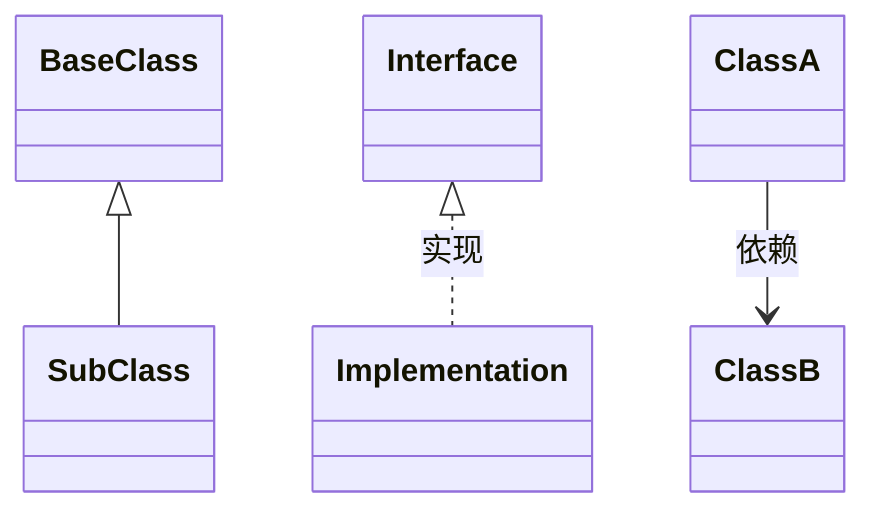
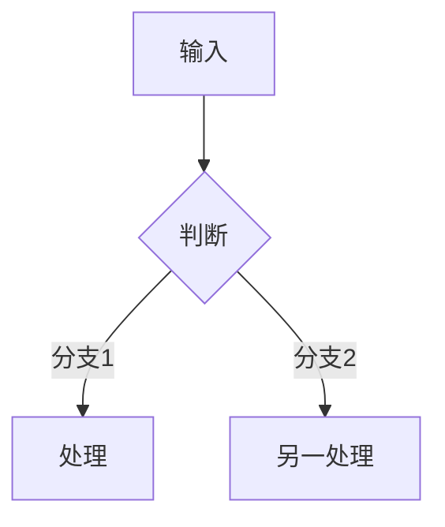
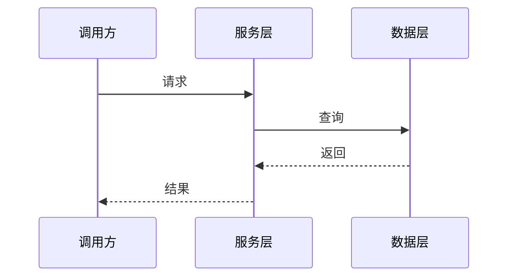

# 详细设计文档模板

# [项目名称] 详细设计文档

**版本**: v1.0 | **日期**: YYYY-MM-DD | **作者**: [作者]
**关联**: 方案设计文档 v1.0

## 目录

1. [类设计](#1-类设计) · 2. [方法设计](#2-方法设计) · 3. [时序图设计](#3-时序图设计) · 4. [流程图设计](#4-流程图设计)
5. [异常处理设计](#5-异常处理设计) · 6. [性能优化设计](#6-性能优化设计) · 7. [安全设计](#7-安全设计) · 8. [测试方案设计](#8-测试方案设计)

---

## 1. 类设计

### 1.1 核心类列表

按模块列出，每模块一张表：

| 类名 | 类类型 | 包名 | 继承关系 | 依赖类 |
|------|--------|------|---------|--------|
| **ClassName** | ViewModel | `com.app.module` | extends BaseClass | DepClass |

### 1.2 继承关系图



### 1.3 属性定义

| 属性名 | 属性类型 | 可见性 | 默认值 | 说明 |
|--------|---------|--------|--------|------|
| **propName** | Type | private/public | default | 用途 |

### 1.4 方法签名

```
ClassName
├── public fun methodName(param: Type): ReturnType
├── private fun helperMethod(): Unit
└── override fun lifecycleMethod()
```

---

## 2. 方法设计

### 2.1 核心方法签名

列出每个模块的关键方法声明。

### 2.2 方法职责描述

| 方法名 | 所属类 | 职责描述 | 调用时机 |
|--------|--------|---------|---------|
| **methodName()** | ClassName | 做什么 | 何时被调用 |

### 2.3 输入输出定义

```
methodName(param1: Type, param2: Type): ReturnType

输入：param1（约束、是否必填）、param2（说明）
输出：ReturnType（成功/失败含义）
```

### 2.4 算法流程



---

## 3. 时序图设计

### 3.1 核心业务流程时序图



### 3.2 异步流程时序图

覆盖异步任务生命周期（启动→完成→回调）。

### 3.3 异常处理时序图

覆盖主要异常路径（网络异常、数据异常、超时）。

---

## 4. 流程图设计

### 4.1 核心算法流程图

关键算法的决策分支和控制流。

### 4.2 业务逻辑流程图

核心业务规则的流程表示。

### 4.3 数据处理流程图

数据在各层之间的流转路径。

---

## 5. 异常处理设计

### 5.1 异常分类定义

| 异常ID | 异常名称 | 异常类型 | 异常场景 | 异常等级 |
|--------|---------|---------|---------|---------|
| E-001 | ExceptionName | 网络/认证/业务 | 触发条件 | 高/中/低 |

### 5.2 处理策略

| 异常ID | 处理策略 | 用户提示 | 恢复操作 |
|--------|---------|---------|---------|
| E-001 | 如何处理 | 对用户说什么 | 如何恢复 |

### 5.3 恢复机制

关键异常的恢复流程（重试策略、降级方案、超时处理）。

### 5.4 错误码定义

| 错误码 | 错误名称 | 错误描述 | 呈现方式 |
|--------|---------|---------|---------|
| 1001 | ERROR_NAME | 描述 | 日志 / UI / 协议应答 |

---

## 6. 性能优化设计

### 6.1 性能瓶颈分析

| 瓶颈点 | 所属模块 | 瓶颈描述 | 影响 |
|--------|---------|---------|------|

### 6.2 优化策略

| 瓶颈点 | 优化策略 | 优化效果 | 实施难度 |
|--------|---------|---------|---------|

### 6.3 监控方案

关键性能指标的采集和上报方式。

### 6.4 性能指标

| 性能指标 | 目标值 | 测量方法 | 优先级 |
|---------|--------|---------|--------|

---

## 7. 安全设计

### 7.1 认证授权机制

Token 格式、验证流程、刷新策略、权限模型。

### 7.2 数据加密策略

| 数据类型 | 加密算法 | 加密时机 | 解密时机 |
|---------|---------|---------|---------|

### 7.3 安全防护措施

| 安全威胁 | 防护措施 | 实施位置 | 检查频率 |
|---------|---------|---------|---------|

### 7.4 安全检查清单

- [ ] 密码加密存储
- [ ] TLS 网络传输（证书校验）
- [ ] 令牌/会话校验（若有）
- [ ] 输入参数验证
- [ ] 敏感信息不出现于日志
- [ ] 错误消息不暴露内部细节

---

## 8. 测试方案设计

### 8.1 单元测试策略

每个核心类的测试覆盖范围、Mock 策略。

### 8.2 集成测试策略

跨模块交互的测试方式、测试数据准备。

### 8.3 性能测试策略

关键路径的响应时间基准和压测方案。

### 8.4 测试用例

| 用例ID | 用例名称 | 测试类型 | 测试步骤 | 预期结果 |
|--------|---------|---------|---------|---------|
| TC-001 | 用例描述 | 单元/集成/性能 | 操作步骤 | 期望结果 |

> 覆盖正常路径、边界条件、异常场景。每个公共方法至少 3 条用例。
