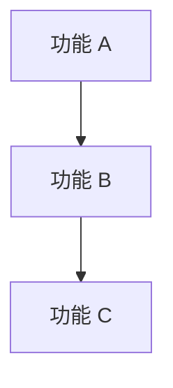
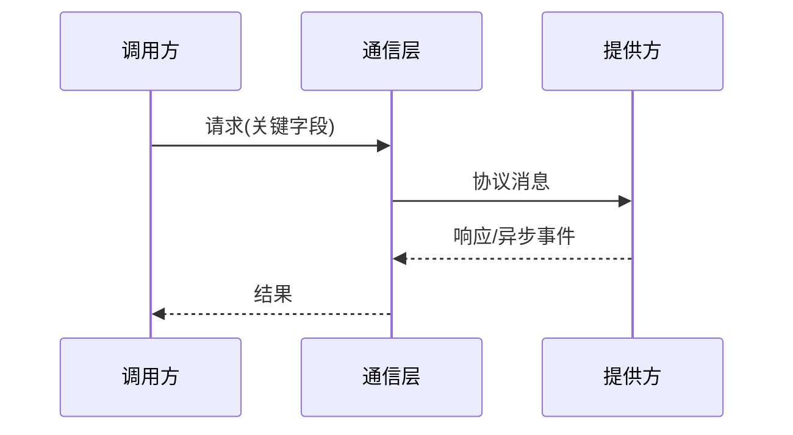
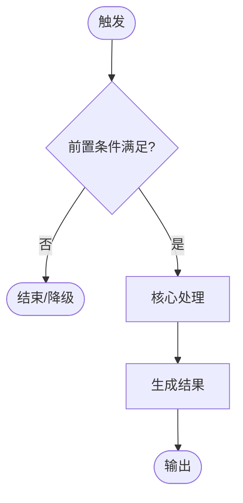
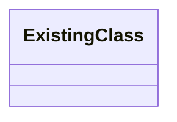
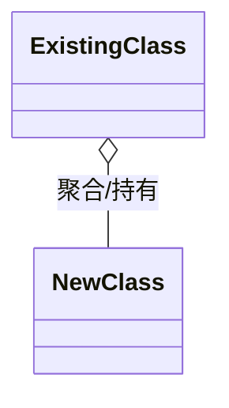
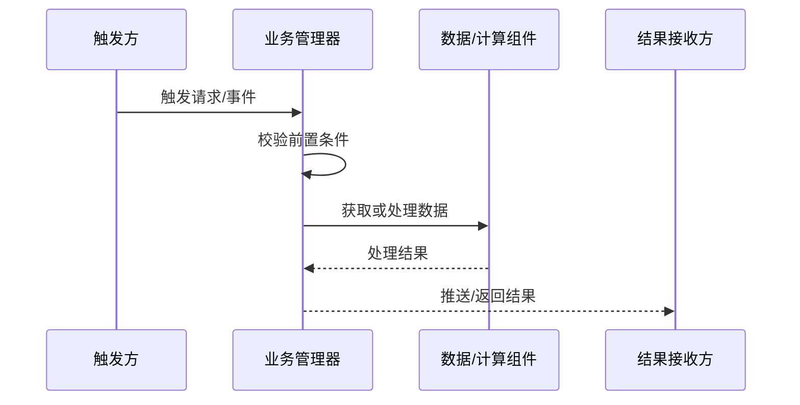
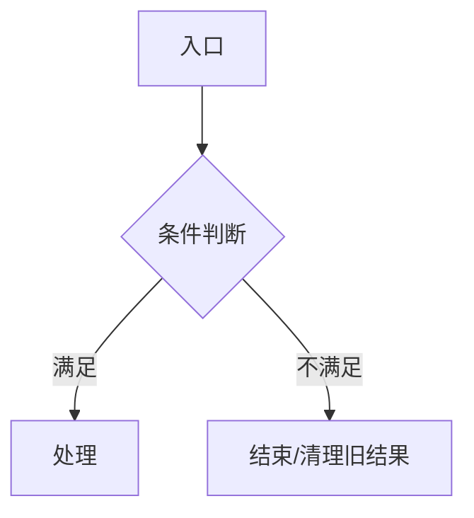
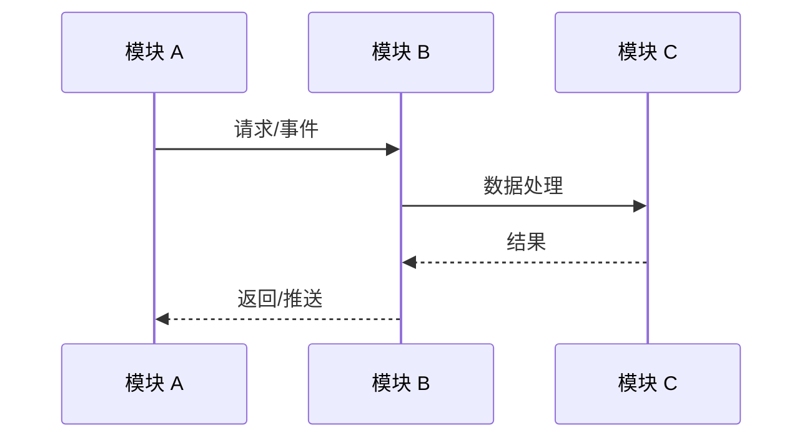

# 方案设计评审文档模板

## 模板使用规则

- 本模板用于将已确认的需求文档、`proposal.md`、`specs/` 和 `design.md` 整理为可正式评审的方案设计文档。
- 一级章节固定为九章，不得省略；确实不涉及的章节写明“不涉及”及理由。
- 模块章节按实际系统边界重复，不使用“模块一”“模块二”等虚构名称。
- 所有流程图、类图、接口、配置和数据结构必须来自需求或现有工程事实；无法确认的内容写入“评审待确认项”，不得补写为既定事实。
- 重要设计决策必须给出备选方案、取舍依据和最终结论。
- Mermaid 图使用实际模块名、类名、接口名和数据类型；正文负责解释图中无法表达的约束、异常和边界。
- 自测用例必须覆盖正常路径、边界条件、异常路径、配置变化和兼容性场景。

---

# [项目/功能名称] 方案设计评审

| 文档属性 | 内容 |
|----------|------|
| 文档版本 | v1.0 |
| 文档状态 | 草稿 / 评审中 / 已定稿 |
| 编写日期 | YYYY-MM-DD |
| 编写人 | [姓名] |
| 评审人 | [姓名/角色] |
| 需求来源 | [需求文档名称及版本] |
| 代码基准 | [分支、提交号或版本；纯新增项目填“不适用”] |

## 文件修改记录

| 文件版本 | 日期 | 作者 | 修改描述 |
|----------|------|------|----------|
| v1.0 | YYYY-MM-DD | [姓名] | 初始版本 |

## 目录

1. [引言](#1-引言)
2. [需求定义](#2-需求定义)
3. [需求分解](#3-需求分解)
4. [协议解读](#4-协议解读)
5. [方案设计](#5-方案设计)
6. [自测用例](#6-自测用例)
7. [集成计划](#7-集成计划)
8. [工作量评估](#8-工作量评估)
9. [附录](#9-附录)

---

## 1. 引言

### 1.1 背景

[说明业务背景、现状问题、使用场景以及为什么需要本功能。]

### 1.2 设计目标

- [目标 1：可验证的业务或技术目标]
- [目标 2]

### 1.3 范围与非范围

**本次范围：**

- [本次实现的能力]

**非本次范围：**

- [明确不实现或后续实现的能力及原因]

### 1.4 定义

| 术语/缩写 | 定义 | 补充说明 |
|-----------|------|----------|
| [术语] | [定义] | [适用范围或注意事项] |

---

## 2. 需求定义

### 2.1 需求依据

| 需求来源 | 版本/章节 | 与本方案的关系 |
|----------|-----------|----------------|
| [需求文档或规范] | [版本、章节号] | [约束或功能来源] |

### 2.2 需求目标与验收标准

| 需求 ID | 需求描述 | 优先级 | 验收标准 |
|---------|----------|--------|----------|
| FR-001 | [可独立验证的需求] | P0/P1/P2 | [明确、可测试的结果] |

### 2.3 约束条件

| 约束类别 | 约束内容 | 设计影响 |
|----------|----------|----------|
| 平台/机型 | [约束] | [对模块、配置或兼容性的影响] |
| 性能 | [响应时间、周期、数据量等] | [对算法、缓存或线程的影响] |
| 安全/合规 | [约束] | [对权限、日志或数据的影响] |

---

## 3. 需求分解

### 3.1 功能分解

| 功能 ID | 功能名称 | 功能描述 | 使用方/触发方 | 所属模块 |
|---------|----------|----------|---------------|----------|
| F-001 | [功能点] | [具体行为] | [用户/系统/定时任务] | [模块名] |

### 3.2 功能规则与边界

| 功能点 | 前置条件 | 核心规则 | 边界/不支持场景 | 失败时行为 |
|--------|----------|----------|-----------------|------------|
| [功能点] | [条件] | [规则] | [边界] | [返回、降级或提示] |

### 3.3 配置与交互需求

| 配置/交互项 | 可选值或操作 | 默认值 | 联动关系 | 生效时机 |
|-------------|--------------|--------|----------|----------|
| [配置项] | [范围] | [默认值] | [与其他项的关系] | [立即/保存后/重启后] |

### 3.4 功能依赖关系



### 3.5 需求到设计追踪

| 需求 ID | 功能 ID | 设计章节 | 自测用例 |
|---------|---------|----------|----------|
| FR-001 | F-001 | 5.x | TC-001 |

---

## 4. 协议解读

> 不涉及通信协议时写明“不涉及”，并说明模块之间使用的实际交互方式。

### 4.1 协议范围

| 协议/接口 | 方向 | 触发场景 | 同步/异步 | 说明 |
|-----------|------|----------|-----------|------|
| [协议或接口名] | A → B | [场景] | [同步/异步] | [用途] |

### 4.2 消息与字段解读

| 消息/方法 | 关键字段 | 字段来源 | 约束/枚举 | 返回或回流方式 |
|-----------|----------|----------|-----------|----------------|
| [消息名] | `[field]` | [模块/配置] | [范围] | [响应/事件/流推送] |

### 4.3 协议交互流程



### 4.4 兼容性与异常码

| 场景 | 兼容策略 | 错误码/状态 | 调用方处理 |
|------|----------|-------------|------------|
| 新旧版本混用 | [策略] | [错误码] | [重试/降级/忽略] |

---

## 5. 方案设计

### 5.1 总体架构与职责划分

[用一段话说明端到端方案、核心模块、数据来源、计算或处理过程以及最终输出。]


| 模块 | 主要职责 | 输入 | 输出 | 依赖 |
|------|----------|------|------|------|
| [模块名] | [职责] | [数据/事件] | [数据/事件] | [依赖模块] |

### 5.2 [模块 A：实际模块名]

#### 5.2.1 模块描述

[说明模块在整体方案中的位置、负责和不负责的内容。]

##### 功能整体业务流



##### 功能实现职责分配

| 类/组件 | 继承或持有关系 | 职责 | 变更类型 |
|---------|----------------|------|----------|
| `[ClassName]` | [继承/组合/聚合关系] | [职责和关键行为] | 新增/扩展/复用 |

#### 5.2.2 设计类图

##### 原始类图



[说明现有设计可复用的能力和当前限制。纯新增模块写“不涉及”。]

##### 扩展后的类图



| 类/接口 | 核心方法或成员 | 生命周期/所有权 | 设计说明 |
|---------|----------------|-----------------|----------|
| `[ClassName]` | `method(params)` | [创建者、销毁者、线程] | [为什么这样设计] |

#### 5.2.3 数据结构

| 数据结构 | 方向/使用方 | 关键字段 | 生命周期 | 兼容策略 |
|----------|-------------|----------|----------|----------|
| `[TypeName]` | A → B | `[field]` | [创建、更新、销毁] | [新增字段/可选字段] |

```text
[必要时给出精简的结构体、JSON 或 Protobuf 示例；只保留关键字段。]
```

#### 5.2.4 业务处理流程

##### 整体业务流程

[先用文字描述入口、前置条件、核心步骤、输出和副作用，再给出时序图。]



##### 关键业务流 A：[业务流名称]

- **触发场景**：[入口和时机]
- **前置条件**：[条件]
- **处理步骤**：[按顺序描述]
- **状态变化**：[缓存、状态机或持久化变化]
- **失败处理**：[错误、超时、重试或降级]
- **最终结果**：[输出及副作用]



> 按实际复杂度重复“关键业务流”小节。配置更新、结果重算、数据查询、用户确认等独立触发链路应分别描述，不得挤在一张总图中。

#### 5.2.5 算法与扩展接口

| 接口/算法 | 输入 | 输出 | 核心规则 | 扩展点 |
|-----------|------|------|----------|--------|
| `method(params)` | [输入] | [输出] | [公式、排序、过滤等] | [可替换或扩展方式] |

**公式或伪代码：**

```text
[算法公式、阈值规则或关键伪代码]
```

#### 5.2.6 配置信息

| 配置路径/键 | 类型 | 默认值 | 可选范围 | 生效时机 | 适用范围 |
|-------------|------|--------|----------|----------|----------|
| `[config.key]` | [类型] | [值] | [范围] | [时机] | [机型/版本/模块] |

### 5.3 [模块 B：实际模块名]

> 按 5.2 的结构填写。只保留该模块实际涉及的子章节；不涉及的子章节写明理由。

### 5.N 跨模块协作流程



### 5.N+1 并发与同步

| 并发对象/任务 | 所在线程或执行器 | 共享状态 | 同步机制 | 超时/防重入策略 |
|---------------|------------------|----------|----------|-----------------|
| [任务] | [线程] | [状态] | [锁/队列/原子变量] | [策略] |

### 5.N+2 异常处理

| 层级 | 异常场景 | 检测方式 | 处理策略 | 状态恢复 | 用户/调用方感知 |
|------|----------|----------|----------|----------|-----------------|
| [层级] | [场景] | [错误码/超时/校验] | [重试/降级/清理] | [如何恢复] | [提示或返回] |

### 5.N+3 影响分析

| 受影响模块/文件 | 变更类型 | 影响说明 | 回归范围 | 风险等级 |
|-----------------|----------|----------|----------|----------|
| [模块或路径] | 新增/修改/复用 | [影响] | [需回归内容] | 低/中/高 |

### 5.N+4 兼容性分析

| 兼容维度 | 现有行为 | 新行为 | 兼容策略 | 验证方式 |
|----------|----------|--------|----------|----------|
| 接口/数据/配置/平台 | [现状] | [变化] | [策略] | [测试] |

### 5.N+5 重要设计决策

| 决策 ID | 决策问题 | 方案 A | 方案 B | 结论 | 选择理由 |
|---------|----------|--------|--------|------|----------|
| ADR-001 | [问题] | [优缺点] | [优缺点] | 采用 A/B | [架构、性能、维护性等依据] |

### 5.N+6 第三方/OTS 软件使用

| 软件/组件 | 版本 | 用途 | 许可证 | 引入方式 | 风险 |
|-----------|------|------|--------|----------|------|
| [名称] | [版本] | [用途] | [许可证] | [源码/包/系统组件] | [风险] |

> 不涉及第三方或 OTS 软件时写“无”。

### 5.N+7 评审待确认项

| 编号 | 待确认问题 | 影响 | 建议选项 | 结论/责任人 |
|------|------------|------|----------|-------------|
| Q-001 | [尚未闭合的问题] | [对方案或排期的影响] | [A/B] | [评审时填写] |

---

## 6. 自测用例

### 6.1 覆盖范围

| 需求/功能 | 正常路径 | 边界条件 | 异常路径 | 配置/兼容场景 | 对应用例 |
|-----------|----------|----------|----------|---------------|----------|
| FR-001 / F-001 | 已覆盖 | 已覆盖 | 已覆盖 | 已覆盖 | TC-001～TC-00N |

### 6.2 测试用例 TC-001：[用例名称]

| 字段 | 内容 |
|------|------|
| 测试编号 | TC-001 |
| 测试内容 | [验证目标，只描述一个行为] |
| 前置条件 | [环境、配置、数据和状态] |
| 测试步骤 | 1. [步骤一]<br>2. [步骤二]<br>3. [步骤三] |
| 预期结果 | [可观察、可判定的结果] |

> 按需复制测试用例小节。至少覆盖：功能开关与默认值、支持/不支持范围、配置联动、正常触发、边界数据、异常或超时、接受/拒绝或成功/失败分支、兼容性。

---

## 7. 集成计划

### 7.1 集成步骤

| 步骤 | 集成内容 | 提供方 | 接收方 | 前置依赖 | 完成标志 |
|------|----------|--------|--------|----------|----------|
| 1 | [接口/模块/功能] | [团队/模块] | [团队/模块] | [依赖] | [可验证结果] |

### 7.2 联调与发布策略

| 阶段 | 环境 | 验证内容 | 进入条件 | 退出/回退条件 |
|------|------|----------|----------|---------------|
| [阶段] | [环境] | [内容] | [条件] | [条件] |

### 7.3 集成风险

| 风险 | 发生条件 | 影响 | 缓解措施 | 责任人 |
|------|----------|------|----------|--------|
| [风险] | [条件] | [影响] | [措施] | [责任人] |

---

## 8. 工作量评估

### 8.1 功能工作量

| 序号 | 功能点 | 描述 | 计划工时（人天） | 负责人 | 备注 |
|------|--------|------|------------------|--------|------|
| 1 | [功能点] | [工作内容和交付物] | [人天] | [姓名] | [依赖或风险] |

### 8.2 评估汇总

| 评估人/角色 | 工作量评估（人天） | 评估说明 |
|-------------|--------------------|----------|
| 技术经理 | [人天] | [说明] |
| 项目经理 | [人天] | [说明] |
| 开发工程师 | [人天] | [说明] |

---

## 9. 附录

### 9.1 参考资料

| 资料 | 版本/链接 | 用途 |
|------|-----------|------|
| [需求、协议或架构文档] | [版本/路径] | [引用内容] |

### 9.2 评审结论与行动项

| 编号 | 评审结论/行动项 | 责任人 | 计划完成时间 | 状态 |
|------|-----------------|--------|--------------|------|
| A-001 | [结论或后续动作] | [姓名] | YYYY-MM-DD | 待处理/已完成 |

### 9.3 模板应用说明

- 删除所有方括号占位说明并填入真实内容。
- 一级章节必须保留；不涉及的章节写明“不涉及”及原因。
- 根据模块数量复制 5.2 模块章节，根据业务复杂度复制关键业务流和测试用例章节。
- 完成后检查需求、设计章节和测试用例之间是否可双向追踪。
